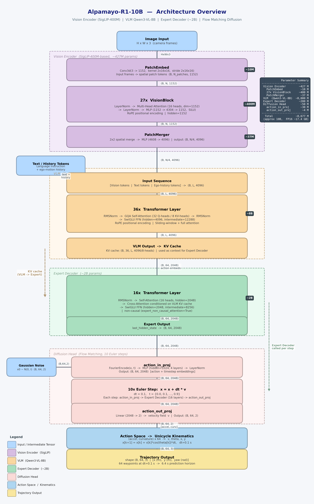

# Alpamayo-R1-10B Architecture Overview

## 전체 아키텍처 블록도



위 그림은 Alpamayo-R1-10B의 전체 추론 파이프라인을 7단계로 나누어 시각화한 블록도.
카메라 이미지 입력부터 최종 경로(trajectory) 출력까지의 텐서 흐름, 각 모듈의 내부 구조, 파라미터 규모를 한눈에 파악 가능하도록 구성.

---

## 그림 설명

### 1. Image Input

- **역할**: 자율주행 차량의 카메라로부터 수집된 원시 프레임을 모델에 공급하는 입력 단계
- **텐서 형태**: `H x W x 3` (높이 x 너비 x RGB 3채널)
- **설명**: 단일 또는 다중 카메라 프레임이 모델의 첫 번째 처리 단계인 Vision Encoder로 전달. 이미지 해상도(H, W)는 학습/추론 설정에 따라 결정되며, 3채널 RGB 형식의 부동소수점 텐서로 정규화된 상태로 입력.

---

### 2. Vision Encoder (SigLIP-400M, ~427M params)

Vision Encoder는 SigLIP-400M 아키텍처를 기반으로 한 시각 특징 추출기. 이미지를 패치 단위로 분해하고, Transformer 블록을 통해 고차원 시각 표현을 생성한 후, 공간 압축을 거쳐 VLM에 전달 가능한 토큰 시퀀스로 변환. 총 3개의 하위 모듈로 구성.

#### 2-1. PatchEmbed (~10M params)

- **구조**: `Conv3d(3 -> 1152, kernel=2x16x16, stride=2x16x16)`
- **기능**: 입력 프레임을 16x16 크기의 비겹침(non-overlapping) 패치로 분할하고, 각 패치를 1152차원 임베딩 벡터로 변환
- **출력**: `(B, N_patches, 1152)` — B는 배치 크기, N_patches는 총 패치 수
- **특이사항**: Conv3d 사용으로 시간축(temporal) 2프레임을 동시 처리 가능. kernel 첫 번째 차원이 2로 설정되어 연속 2프레임의 시공간 패치 임베딩 수행

#### 2-2. 27x VisionBlock (~400M params)

- **구조**: 27개 동일 블록의 반복 스택
  - `LayerNorm -> Multi-Head Attention (16 heads, dim=1152) -> LayerNorm -> MLP (1152 -> 4304 -> 1152, SiLU)`
- **위치 인코딩**: RoPE (Rotary Position Embedding) 적용
- **기능**: 패치 임베딩 간의 전역 관계(global relationship)를 모델링. 16개 어텐션 헤드로 다양한 시각적 패턴을 병렬 포착하며, MLP 확장 비율(4304/1152 ≈ 3.74x)을 통해 비선형 특징 변환 수행
- **출력**: `(B, N_patches, 1152)` — 입력과 동일한 형태(residual connection)

#### 2-3. PatchMerger (~37M params)

- **구조**: 2x2 공간 병합 + `MLP(4608 -> 4096)`
- **기능**: 인접한 2x2 패치 토큰을 하나로 병합하여 시퀀스 길이를 1/4로 축소. 4개의 1152차원 벡터를 연결(concatenate)하면 4608차원이 되며, MLP를 통해 VLM 입력 차원인 4096으로 투사
- **출력**: `(B, N/4, 4096)` — 패치 수 1/4 감소, 차원 1152 -> 4096 변환
- **효과**: VLM에 전달되는 시각 토큰 수를 대폭 감소시켜 계산 효율 향상. 동시에 차원을 VLM의 hidden_size(4096)에 정렬

---

### 3. VLM — Qwen3-VL-8B (~8B params)

Vision-Language Model(VLM)은 시각 토큰과 언어/이력 토큰을 통합하여 멀티모달 컨텍스트를 생성하는 핵심 모듈. Qwen3-VL-8B 아키텍처 기반으로, 대규모 사전학습된 언어 모델의 추론 능력을 활용.

#### 3-1. Input Sequence

- **구성**: `[Vision tokens | Text tokens | Ego-history tokens]`
- **텐서 형태**: `(B, L, 4096)` — L은 전체 시퀀스 길이(시각 + 텍스트 + 이력 토큰의 합)
- **Vision tokens**: PatchMerger 출력으로부터 전달된 시각 표현
- **Text tokens**: 자연어 명령 또는 주행 지시어(예: "좌회전", "직진 유지") 임베딩
- **Ego-history tokens**: 차량의 과거 자기운동(ego-motion) 이력 인코딩

#### 3-2. 36x Transformer Layer (~8B params)

- **구조**: 36개 Transformer 레이어 스택
  - `RMSNorm -> GQA Self-Attention (32 Q-heads / 8 KV-heads) -> RMSNorm -> SwiGLU FFN (4096 -> 12288 -> 4096)`
- **어텐션**: Grouped-Query Attention (GQA) 적용
  - 32개 Query 헤드, 8개 KV 헤드 (4:1 비율)
  - KV 헤드 공유를 통해 메모리 사용량 절감 (KV cache 크기 1/4)
  - Sliding-window attention과 full attention 혼합 사용
- **FFN**: SwiGLU 활성화 함수, 확장 비율 3x (4096 -> 12288)
- **위치 인코딩**: RoPE 적용
- **출력**: `(B, L, 4096)`

#### 3-3. VLM Output -> KV Cache

- **기능**: VLM의 최종 출력에서 KV cache를 추출하여 Expert Decoder의 Cross-Attention 컨텍스트로 제공
- **KV cache 형태**: `(B, 36_layers, L, head_dim)` — 모든 레이어의 Key-Value 쌍 저장
- **연결 방식**: 점선 화살표(dashed arrow)로 표현된 VLM -> Expert Decoder 간의 KV cache 전달 경로가 블록도 좌측에 표시

---

### 4. Expert Decoder (~2B params)

Expert Decoder는 VLM이 생성한 멀티모달 컨텍스트를 기반으로 행동(action) 표현을 정제하는 전용 디코더. VLM의 KV cache를 Cross-Attention으로 참조하면서, Diffusion Head로부터 전달되는 action embedding을 처리.

#### 4-1. 16x Transformer Layer (~2B params)

- **구조**: 16개 Transformer 레이어
  - `RMSNorm -> Self-Attention (16 heads, hidden=2048) -> Cross-Attention (VLM KV cache 참조) -> SwiGLU FFN (2048 -> 8256 -> 2048)`
- **Self-Attention**: 16개 헤드, hidden_dim=2048
- **Cross-Attention**: VLM의 KV cache를 Key/Value로 사용하여 멀티모달 컨텍스트 참조
- **FFN**: SwiGLU, 확장 비율 약 4x (2048 -> 8256)
- **Non-causal attention**: `expert_non_causal_attention=True` — 미래 토큰도 참조 가능한 양방향 어텐션 사용. 인과적(causal) 마스킹 비적용

#### 4-2. Expert Output

- **출력**: `(B, 64, 2048)` — 64개 action 토큰, 각 2048차원
- **의미**: 64개 시간 스텝에 대응하는 행동 표현. Diffusion Head의 각 Euler step에서 반복 호출

---

### 5. Diffusion Head (Flow Matching)

Diffusion Head는 Flow Matching 방식의 확산 모델로, 가우시안 노이즈로부터 시작하여 10단계 Euler 적분을 통해 행동 시퀀스를 생성. Expert Decoder를 매 스텝마다 호출하여 velocity field를 예측.

#### 5-1. action_in_proj

- **구조**: `FourierEncode(x, t) -> MLP (hidden=1024, 4 layers) -> LayerNorm`
- **입력**: 현재 noisy action `x`와 timestep `t`
- **기능**: Fourier feature encoding으로 연속적인 timestep 정보를 고차원으로 확장 후, MLP를 통해 Expert Decoder 입력 차원(2048)으로 투사
- **출력**: `(B, 64, 2048)` — action embedding + timestep embedding 결합

#### 5-2. 10x Euler Step

- **수식**: `x = x + dt * v` (dt = 0.1)
- **스텝**: t = {0.0, 0.1, 0.2, ..., 0.9} 총 10단계
- **흐름**: 각 스텝마다 `action_in_proj -> Expert Decoder (16 layers) -> action_out_proj` 전체 파이프라인 실행
- **특성**: 블록도 우측의 점선 화살표가 Expert Decoder와의 반복 호출 관계를 표현. 10회 반복으로 인해 Expert Decoder가 전체 추론 시간의 지배적 비중 차지

#### 5-3. action_out_proj

- **구조**: `Linear(2048 -> 2)`
- **기능**: Expert Decoder 출력을 2차원 velocity field `v`로 투사
- **출력**: `(B, 64, 2)` — 각 시간 스텝에서의 (가속도, 곡률) 예측값

---

### 6. Action Space

- **입력**: `(B, 64, 2)` — (acceleration, curvature) x 64 스텝
- **변환**: Unicycle kinematics 모델 적용
  - `v[k+1] = v[k] + accel[k] * dt`
  - `theta[k+1] = theta[k] + v[k] * curvature[k] * dt`
  - `x[k+1] = x[k] + v[k] * cos(theta[k]) * dt`
  - `y[k+1] = y[k] + v[k] * sin(theta[k]) * dt`
- **의미**: 저차원 action space (가속도, 곡률)로부터 물리적으로 실현 가능한(physically feasible) 경로를 생성. Unicycle 모델은 차량의 비홀로노믹(non-holonomic) 제약을 자연스럽게 반영

---

### 7. Trajectory Output

- **출력 형태**: `(B, 64, 3)` — [x (m), y (m), yaw (rad)]
- **시간 해상도**: dt = 0.1초 간격, 64개 웨이포인트
- **예측 수평선**: 64 x 0.1 = **6.4초** 미래 경로 예측
- **좌표계**: 차량 중심 로컬 좌표계 (ego-centric coordinate frame)
- **활용**: 생성된 경로를 하위 제어기(controller)에 전달하여 실제 차량 조향/가감속 명령으로 변환

---

### 텐서 흐름 요약 표

| 단계 | 모듈 | 입력 텐서 | 출력 텐서 |
|------|------|-----------|-----------|
| 1 | Image Input | 카메라 프레임 | (B, H, W, 3) |
| 2-1 | PatchEmbed | (B, 2, H, W, 3) | (B, N, 1152) |
| 2-2 | 27x VisionBlock | (B, N, 1152) | (B, N, 1152) |
| 2-3 | PatchMerger | (B, N, 1152) | (B, N/4, 4096) |
| 3-1 | VLM Input Sequence | [Vision \| Text \| History] | (B, L, 4096) |
| 3-2 | 36x Transformer | (B, L, 4096) | (B, L, 4096) |
| 3-3 | VLM Output / KV Cache | (B, L, 4096) | KV: (B, 36, L, head_dim) |
| 4-1 | 16x Expert Transformer | (B, 64, 2048) + KV cache | (B, 64, 2048) |
| 5-1 | action_in_proj | (B, 64, 2) + timestep t | (B, 64, 2048) |
| 5-2 | 10x Euler Step | x_t (B, 64, 2) | x_{t+1} (B, 64, 2) |
| 5-3 | action_out_proj | (B, 64, 2048) | (B, 64, 2) |
| 6 | Unicycle Kinematics | (B, 64, 2) [accel, curv] | (B, 64, 3) [x, y, yaw] |
| 7 | Trajectory Output | (B, 64, 3) | 64 waypoints, 6.4s horizon |

---

### 파라미터 요약

| 모듈 | 하위 구성 | 파라미터 수 | 비중 |
|------|-----------|------------|------|
| **Vision Encoder** | | **~427M** | **4.9%** |
| | PatchEmbed | ~10M | 0.1% |
| | 27x VisionBlock | ~400M | 4.6% |
| | PatchMerger | ~37M | 0.4% |
| **VLM (Qwen3-VL-8B)** | 36x Transformer | **~8,000M** | **92.2%** |
| **Expert Decoder** | 16x Transformer | **~200M** | **2.3%** |
| **Diffusion Head** | | **~50M** | **0.6%** |
| | action_in_proj | ~30M | 0.3% |
| | action_out_proj | ~4M | <0.1% |
| **합계** | | **~8,677M (~10B)** | **100%** |

- FP16 메모리 사용량: 약 **17.4 GB** (8,677M x 2 bytes)
- VLM이 전체 파라미터의 92% 이상을 차지하며, 추론 시 메모리 병목의 주요 원인
- Expert Decoder는 파라미터 수 대비 10회 반복 호출로 인해 계산량(FLOPs) 기여가 파라미터 비중보다 훨씬 높음

---

## 시각화 코드

아래는 위 아키텍처 블록도를 생성하는 전체 Python 소스코드. matplotlib 기반으로 수동 레이아웃된 블록 다이어그램 생성.

```python
"""
visualize_architecture.py

Comprehensive architecture block diagram for Alpamayo-R1-10B.

Layout: vertical flow, top to bottom (canvas 16 x 26)
  1. Image Input
  2. Vision Encoder  (SigLIP-400M-based)
       PatchEmbed: Conv3d(3 to 1152, k=2x16x16)
       27x VisionBlock: LN -> Attn(16h, 1152) -> MLP(1152->4304->1152)
       PatchMerger: 2x2 merge + MLP(4608->4096)
  3. VLM  (Qwen3-VL-8B)
       36 Transformer layers, hidden=4096, 32 heads / 8 KV (GQA)
       intermediate=12288
       Input: [vision tokens + text/history tokens]
       Output: KV cache for Expert conditioning
  4. Expert Decoder  (~2B)
       16 Transformer layers, hidden=2048, 16 heads, intermediate=8256
       Uses VLM KV cache as context
  5. Diffusion Head
       action_in_proj: FourierEncode + MLP -> (B, 64, 2048)
       10 Euler steps through Expert Decoder
       action_out_proj: Linear(2048->2) -> velocity field
  6. Action Space / Trajectory Output
       (accel, curvature) -> Unicycle kinematics -> (x, y, yaw)
       64 waypoints, dt=0.1s

Saved to: /home/seungwoo/workspace/analysis/figures/architecture_overview.png
"""

import os
import matplotlib
import matplotlib.pyplot as plt
from matplotlib.patches import FancyBboxPatch

matplotlib.rcParams.update({
    "font.family": "DejaVu Sans",
    "figure.dpi": 150,
})


# ---------------------------------------------------------------------------
# Colour palette
# ---------------------------------------------------------------------------
def _darken(hex_color: str, amount: float = 0.30) -> str:
    """Return a darkened version of a hex colour string."""
    hex_color = hex_color.lstrip("#")
    r, g, b = (int(hex_color[i:i + 2], 16) for i in (0, 2, 4))
    r = max(0, int(r * (1 - amount)))
    g = max(0, int(g * (1 - amount)))
    b = max(0, int(b * (1 - amount)))
    return f"#{r:02x}{g:02x}{b:02x}"


C = {
    "bg"       : "#F5F7FA",
    "input"    : "#B3D9FF",   # light blue   — I/O tensors
    "vision"   : "#D7BDE2",   # lavender     — Vision Encoder
    "vlm"      : "#FAD7A0",   # peach        — VLM
    "expert"   : "#A9DFBF",   # light green  — Expert Decoder
    "diffusion": "#FADBD8",   # light pink   — Diffusion Head
    "action"   : "#AED6F1",   # sky blue     — Action space
    "traj"     : "#F9E79F",   # yellow       — Trajectory output
    "arrow"    : "#2C3E50",   # dark slate
    "subblock" : "#FDFEFE",   # near-white sub-block fill
    "math"     : "#EBF5FB",
}


# ---------------------------------------------------------------------------
# Drawing primitives
# ---------------------------------------------------------------------------
def _block(ax, cx, cy, w, h,
           title, detail="",
           color=C["input"], lw=1.8,
           title_fs=10, detail_fs=8.2,
           zorder=3, radius=0.18):
    """Rounded rectangle with a title and optional detail text."""
    ec = _darken(color)
    patch = FancyBboxPatch(
        (cx - w / 2, cy - h / 2), w, h,
        boxstyle=f"round,pad={radius}",
        facecolor=color, edgecolor=ec, linewidth=lw, zorder=zorder,
    )
    ax.add_patch(patch)
    if detail:
        ax.text(cx, cy + h * 0.13, title,
                ha="center", va="center",
                fontsize=title_fs, fontweight="bold", zorder=zorder + 1)
        ax.text(cx, cy - h * 0.20, detail,
                ha="center", va="center",
                fontsize=detail_fs, color="#424242",
                linespacing=1.35, zorder=zorder + 1)
    else:
        ax.text(cx, cy, title,
                ha="center", va="center",
                fontsize=title_fs, fontweight="bold", zorder=zorder + 1)


def _varrow(ax, x, y0, y1, label="", label_x_offset=0.18,
            color=C["arrow"], lw=1.6, mutation_scale=14, zorder=2):
    """Vertical arrow from (x, y0) to (x, y1)."""
    ax.annotate("", xy=(x, y1), xytext=(x, y0),
                arrowprops=dict(
                    arrowstyle="-|>", color=color, lw=lw,
                    mutation_scale=mutation_scale,
                    connectionstyle="arc3,rad=0.0",
                ),
                zorder=zorder)
    if label:
        my = (y0 + y1) / 2
        ax.text(x + label_x_offset, my, label,
                ha="left", va="center",
                fontsize=7.8, color="#37474F",
                bbox=dict(fc="white", ec="none", alpha=0.75, pad=1.5),
                zorder=zorder + 1)


def _harrow(ax, x0, x1, y, label="", label_y_offset=0.12,
            color=C["arrow"], lw=1.6, mutation_scale=14, zorder=2):
    """Horizontal arrow from (x0, y) to (x1, y)."""
    ax.annotate("", xy=(x1, y), xytext=(x0, y),
                arrowprops=dict(
                    arrowstyle="-|>", color=color, lw=lw,
                    mutation_scale=mutation_scale,
                    connectionstyle="arc3,rad=0.0",
                ),
                zorder=zorder)
    if label:
        mx = (x0 + x1) / 2
        ax.text(mx, y + label_y_offset, label,
                ha="center", va="bottom",
                fontsize=7.8, color="#37474F",
                bbox=dict(fc="white", ec="none", alpha=0.75, pad=1.5),
                zorder=zorder + 1)


def _param_badge(ax, cx, cy, text, zorder=6):
    """Small dark badge for parameter count annotation."""
    ax.text(cx, cy, text,
            ha="center", va="center",
            fontsize=7.5, color="white", fontweight="bold",
            bbox=dict(boxstyle="round,pad=0.35",
                      fc="#37474F", ec="#263238",
                      linewidth=1.0),
            zorder=zorder)


# ---------------------------------------------------------------------------
# Figure builder
# ---------------------------------------------------------------------------
def build_figure() -> plt.Figure:
    """
    Vertical flow diagram.

    Canvas: x in [0, 16], y in [0, 26]  (figure 16 x 26 inches)
    Flow:  y decreases downward  (top = 25.5, bottom = 0.3)

    Vertical positions (y centre of each major block):
      Image Input        : 24.0
      Vision Encoder     : 18.4 – 23.3
        PatchEmbed       : 22.5
        27x VisionBlock  : 20.7
        PatchMerger      : 19.0
      Text / History     : 17.5  (side input, above VLM group)
      VLM                : 12.8 – 17.2
        Input Sequence   : 16.6
        36x Transformer  : 15.0
        VLM Output / KV  : 13.2
      Expert Decoder     : 8.8 – 12.0
        16x Transformer  : 10.6
        Expert Output    : 9.15
      Diffusion Head     : 4.2 – 7.8
        action_in_proj   : 7.0
        10x Euler Step   : 5.7
        action_out_proj  : 4.6
      Action Space       : 3.3
      Trajectory Output  : 2.2
      Legend              : 0.3 – 3.3  (bottom-left)
      Param Summary      : 22.0        (top-right)
    """
    fig, ax = plt.subplots(figsize=(16, 26))
    fig.patch.set_facecolor(C["bg"])
    ax.set_facecolor(C["bg"])
    ax.set_xlim(0, 16)
    ax.set_ylim(0, 26)
    ax.axis("off")

    CX = 8.0   # horizontal centre of main column

    # ============================================================
    # Header
    # ============================================================
    ax.text(CX, 25.5,
            "Alpamayo-R1-10B  —  Architecture Overview",
            ha="center", va="center",
            fontsize=16, fontweight="bold", color="#1A237E")
    ax.text(CX, 25.1,
            "Vision Encoder (SigLIP-400M)  |  VLM Qwen3-VL-8B  |  "
            "Expert Decoder (~2B)  |  Flow Matching Diffusion",
            ha="center", va="center",
            fontsize=9.5, color="#546E7A")

    # ============================================================
    # 0. Image Input
    # ============================================================
    Y_IMG = 24.0
    _block(ax, CX, Y_IMG, 3.8, 0.65,
           "Image Input",
           "H x W x 3  (camera frames)",
           color=C["input"], title_fs=10, detail_fs=8.5)

    # ============================================================
    # 1. Vision Encoder group  (y: 18.4 – 23.3)
    # ============================================================
    Y_VE_TOP = 23.3
    Y_VE_BOT = 18.4

    group_bg = FancyBboxPatch(
        (2.5, Y_VE_BOT - 0.10), 11.0, Y_VE_TOP - Y_VE_BOT + 0.20,
        boxstyle="round,pad=0.06",
        facecolor="#F3EBF9", edgecolor=_darken(C["vision"], 0.20),
        linewidth=1.4, zorder=1, linestyle="--",
    )
    ax.add_patch(group_bg)
    ax.text(2.65, Y_VE_TOP - 0.05,
            "Vision Encoder  (SigLIP-400M-based,  ~427M params)",
            ha="left", va="top",
            fontsize=9, color=_darken(C["vision"]), fontstyle="italic")

    # PatchEmbed
    Y_PE = 22.5
    _block(ax, CX, Y_PE, 9.0, 0.80,
           "PatchEmbed",
           "Conv3d(3 -> 1152,  kernel 2x16x16,  stride 2x16x16)\n"
           "Input frames -> spatial patch tokens  (B, N_patches, 1152)",
           color=C["vision"], title_fs=10, detail_fs=8.0)
    _param_badge(ax, CX + 4.8, Y_PE, "~10M")

    # 27x VisionBlock
    Y_VB = 20.7
    _block(ax, CX, Y_VB, 9.0, 1.50,
           "27x  VisionBlock",
           "LayerNorm  ->  Multi-Head Attention (16 heads, dim=1152)\n"
           "->  LayerNorm  ->  MLP (1152 -> 4304 -> 1152,  SiLU)\n"
           "RoPE positional encoding  |  hidden=1152",
           color=C["vision"], title_fs=10.5, detail_fs=8.2)
    _param_badge(ax, CX + 4.8, Y_VB, "~400M")

    # PatchMerger
    Y_PM = 19.0
    _block(ax, CX, Y_PM, 9.0, 0.75,
           "PatchMerger",
           "2x2 spatial merge  ->  MLP (4608 -> 4096)  |  output: (B, N/4, 4096)",
           color=C["vision"], title_fs=10, detail_fs=8.0)
    _param_badge(ax, CX + 4.8, Y_PM, "~37M")

    # Arrow: Image Input -> PatchEmbed  (downward: y0 > y1)
    _varrow(ax, CX, Y_IMG - 0.33, Y_PE + 0.40,
            label="HxWx3", label_x_offset=0.20)

    # Internal arrows within Vision Encoder (all downward: y0 > y1)
    _varrow(ax, CX, Y_PE - 0.40, Y_VB + 0.75,
            label="(B, N, 1152)", label_x_offset=0.20, lw=1.4)
    _varrow(ax, CX, Y_VB - 0.75, Y_PM + 0.38,
            label="(B, N, 1152)", label_x_offset=0.20, lw=1.4)

    # ============================================================
    # 2. Text / History tokens (side input, ABOVE VLM group)
    # ============================================================
    Y_TEXT = 17.5
    _block(ax, 2.5, Y_TEXT, 3.2, 0.65,
           "Text / History Tokens",
           "Language instruction\n+ ego-motion history",
           color=C["input"], title_fs=9, detail_fs=7.8)

    # ============================================================
    # 3. VLM  (y: 12.8 – 17.2)
    # ============================================================
    Y_VLM_TOP = 17.2
    Y_VLM_BOT = 12.8

    group_bg_vlm = FancyBboxPatch(
        (2.5, Y_VLM_BOT - 0.10), 11.0, Y_VLM_TOP - Y_VLM_BOT + 0.20,
        boxstyle="round,pad=0.06",
        facecolor="#FFF8EE", edgecolor=_darken(C["vlm"], 0.20),
        linewidth=1.4, zorder=1, linestyle="--",
    )
    ax.add_patch(group_bg_vlm)
    ax.text(2.65, Y_VLM_TOP - 0.05,
            "VLM  (Qwen3-VL-8B,  ~8B params)",
            ha="left", va="top",
            fontsize=9, color=_darken(C["vlm"]), fontstyle="italic")

    Y_VLM_INPUT = 16.6
    _block(ax, CX, Y_VLM_INPUT, 9.0, 0.70,
           "Input Sequence",
           "[Vision tokens  |  Text tokens  |  Ego-history tokens]  ->  (B, L, 4096)",
           color=C["vlm"], title_fs=9.5, detail_fs=8.0)

    Y_VLM_LAYERS = 15.0
    _block(ax, CX, Y_VLM_LAYERS, 9.0, 1.60,
           "36x  Transformer Layer",
           "RMSNorm  ->  GQA Self-Attention (32 Q-heads / 8 KV-heads)  ->  RMSNorm\n"
           "->  SwiGLU FFN (hidden=4096, intermediate=12288)\n"
           "RoPE positional encoding  |  Sliding-window + full attention",
           color=C["vlm"], title_fs=10.5, detail_fs=8.2)
    _param_badge(ax, CX + 4.8, Y_VLM_LAYERS, "~8B")

    Y_VLM_OUT = 13.2
    _block(ax, CX, Y_VLM_OUT, 9.0, 0.70,
           "VLM Output  ->  KV Cache",
           "KV cache: (B, 36, L, 4096/8-heads)  |  used as context for Expert Decoder",
           color=C["vlm"], title_fs=9.5, detail_fs=8.0)

    # VLM internal arrows (downward)
    _varrow(ax, CX, Y_VLM_INPUT - 0.35, Y_VLM_LAYERS + 0.80,
            label="(B, L, 4096)", label_x_offset=0.20, lw=1.4)
    _varrow(ax, CX, Y_VLM_LAYERS - 0.80, Y_VLM_OUT + 0.35,
            label="(B, L, 4096)", label_x_offset=0.20, lw=1.4)

    # Arrow: PatchMerger -> VLM Input
    _varrow(ax, CX, Y_PM - 0.38, Y_VLM_INPUT + 0.35,
            label="(B, N/4, 4096)", label_x_offset=0.20)

    # Arrow: Text tokens -> VLM Input (diagonal from left side)
    ax.annotate("", xy=(CX - 3.5, Y_VLM_INPUT),
                xytext=(2.5 + 1.6, Y_TEXT - 0.33),
                arrowprops=dict(
                    arrowstyle="-|>", color=C["arrow"], lw=1.5,
                    mutation_scale=13,
                    connectionstyle="arc3,rad=-0.15",
                ),
                zorder=2)
    ax.text(3.5, (Y_VLM_INPUT + Y_TEXT) / 2 - 0.1,
            "text +\nhistory",
            ha="right", va="center", fontsize=7.5, color="#37474F",
            bbox=dict(fc="white", ec="none", alpha=0.75, pad=1.5))

    # ============================================================
    # 4. Expert Decoder  (y: 8.8 – 12.0)
    # ============================================================
    Y_EX_TOP = 12.0
    Y_EX_BOT = 8.8
    Y_EX_MID = (Y_EX_TOP + Y_EX_BOT) / 2

    group_bg_ex = FancyBboxPatch(
        (2.5, Y_EX_BOT - 0.10), 11.0, Y_EX_TOP - Y_EX_BOT + 0.20,
        boxstyle="round,pad=0.06",
        facecolor="#EAFAF1", edgecolor=_darken(C["expert"], 0.25),
        linewidth=1.4, zorder=1, linestyle="--",
    )
    ax.add_patch(group_bg_ex)
    ax.text(2.65, Y_EX_TOP - 0.05,
            "Expert Decoder  (~2B params)",
            ha="left", va="top",
            fontsize=9, color=_darken(C["expert"]), fontstyle="italic")

    Y_EX_LAYERS = 10.6
    _block(ax, CX, Y_EX_LAYERS, 9.0, 2.0,
           "16x  Transformer Layer",
           "RMSNorm  ->  Self-Attention (16 heads, hidden=2048)\n"
           "->  Cross-Attention conditioned on VLM KV cache\n"
           "->  SwiGLU FFN (hidden=2048, intermediate=8256)\n"
           "|  non-causal (expert_non_causal_attention=True)",
           color=C["expert"], title_fs=10.5, detail_fs=8.2)
    _param_badge(ax, CX + 4.8, Y_EX_LAYERS, "~2B")

    Y_EX_OUT = 9.15
    _block(ax, CX, Y_EX_OUT, 9.0, 0.60,
           "Expert Output",
           "last_hidden_state  ->  (B, 64, 2048)",
           color=C["expert"], title_fs=9.5, detail_fs=8.0)

    # Expert internal arrow (downward)
    _varrow(ax, CX, Y_EX_LAYERS - 1.0, Y_EX_OUT + 0.30,
            label="(B, 64, 2048)", label_x_offset=0.20, lw=1.4)

    # Arrow: VLM Output -> Expert Decoder (main spine)
    _varrow(ax, CX, Y_VLM_OUT - 0.35, Y_EX_LAYERS + 1.0,
            label="(B, 64, 2048)\naction embeds",
            label_x_offset=0.20)

    # KV cache feed: VLM -> Expert (LEFT side, avoids param summary overlap)
    kv_x = 2.2
    ax.annotate("", xy=(kv_x, Y_EX_LAYERS),
                xytext=(kv_x, Y_VLM_OUT),
                arrowprops=dict(
                    arrowstyle="-|>", color=_darken(C["vlm"]),
                    lw=1.8, mutation_scale=14,
                    linestyle="dashed",
                    connectionstyle="arc3,rad=0.0",
                ),
                zorder=2)
    ax.text(kv_x - 0.15, (Y_VLM_OUT + Y_EX_LAYERS) / 2,
            "KV cache\n(VLM -> Expert)",
            ha="right", va="center", fontsize=8, color=_darken(C["vlm"]),
            fontweight="bold",
            bbox=dict(fc="white", ec="none", alpha=0.75, pad=1.5))

    # ============================================================
    # 5. Diffusion Head  (y: 4.2 – 7.8)
    # ============================================================
    Y_DH_TOP = 7.8
    Y_DH_BOT = 4.2

    group_bg_dh = FancyBboxPatch(
        (2.5, Y_DH_BOT - 0.10), 11.0, Y_DH_TOP - Y_DH_BOT + 0.20,
        boxstyle="round,pad=0.06",
        facecolor="#FEF5F5", edgecolor=_darken(C["diffusion"], 0.25),
        linewidth=1.4, zorder=1, linestyle="--",
    )
    ax.add_patch(group_bg_dh)
    ax.text(2.65, Y_DH_TOP - 0.05,
            "Diffusion Head  (Flow Matching, 10 Euler steps)",
            ha="left", va="top",
            fontsize=9, color=_darken(C["diffusion"]), fontstyle="italic")

    # Noise input (LEFT side entry, outside group panel)
    Y_NOISE = 7.0
    _block(ax, 1.5, Y_NOISE, 2.2, 0.60,
           "Gaussian Noise",
           "x0 ~ N(0, I)  (B, 64, 2)",
           color=C["input"], title_fs=8.5, detail_fs=7.5)

    # action_in_proj
    Y_AINP = 7.0
    _block(ax, CX, Y_AINP, 8.5, 0.72,
           "action_in_proj",
           "FourierEncode(x, t)  ->  MLP (hidden=1024, 4 layers)  ->  LayerNorm\n"
           "Output: (B, 64, 2048)  [action + timestep embeddings]",
           color=C["diffusion"], title_fs=10, detail_fs=8.0)

    # 10 Euler steps loop
    Y_EULER = 5.7
    _block(ax, CX, Y_EULER, 8.5, 1.00,
           "10x Euler Step:  x = x + dt * v",
           "dt = 0.1,   t = {0.0, 0.1, ..., 0.9}\n"
           "Each step: action_in_proj -> Expert Decoder (16 layers) -> action_out_proj",
           color=C["diffusion"], title_fs=10, detail_fs=8.3)

    # action_out_proj
    Y_AOUTP = 4.6
    _block(ax, CX, Y_AOUTP, 8.5, 0.68,
           "action_out_proj",
           "Linear (2048 -> 2)  ->  velocity field  v  |  Output: (B, 64, 2)",
           color=C["diffusion"], title_fs=10, detail_fs=8.0)

    # Arrow: Noise -> action_in_proj (horizontal)
    _harrow(ax, 1.5 + 1.1, CX - 4.25, Y_AINP,
            label="(B,64,2)", label_y_offset=0.10, lw=1.4)

    # Diffusion internal arrows (downward)
    _varrow(ax, CX, Y_AINP - 0.36, Y_EULER + 0.50,
            label="(B, 64, 2048)", label_x_offset=0.20, lw=1.4)
    _varrow(ax, CX, Y_EULER - 0.50, Y_AOUTP + 0.34,
            label="(B, 64, 2048)", label_x_offset=0.20, lw=1.4)

    # Arrow: Expert Output -> Diffusion Head
    _varrow(ax, CX, Y_EX_OUT - 0.30, Y_AINP + 0.36,
            label="(B, 64, 2048)", label_x_offset=0.20)

    # Feedback loop: Expert Decoder called per Euler step (RIGHT side)
    fb_x = 13.8
    ax.annotate("", xy=(fb_x, Y_EULER),
                xytext=(fb_x, Y_EX_MID),
                arrowprops=dict(
                    arrowstyle="-|>", color=_darken(C["expert"]),
                    lw=1.6, mutation_scale=12,
                    linestyle="dashed",
                    connectionstyle="arc3,rad=0.0",
                ),
                zorder=2)
    ax.text(fb_x + 0.15, (Y_EULER + Y_EX_MID) / 2,
            "Expert Decoder\ncalled per step",
            ha="left", va="center", fontsize=7.5,
            color=_darken(C["expert"]), fontweight="bold",
            bbox=dict(fc="white", ec="none", alpha=0.75, pad=1.5))

    # ============================================================
    # 6. Action Space & Trajectory Output
    # ============================================================
    Y_ACT = 3.3
    _block(ax, CX, Y_ACT, 9.0, 0.72,
           "Action Space  ->  Unicycle Kinematics",
           "(accel, curvature) x 64  ->  v, theta, x, y\n"
           "x[k+1] = x[k] + v[k]*cos(theta[k])*dt,   dt=0.1 s",
           color=C["action"], title_fs=10, detail_fs=8.2)

    Y_TRAJ = 2.2
    _block(ax, CX, Y_TRAJ, 9.0, 0.68,
           "Trajectory Output",
           "shape (B, 64, 3)  |  [x (m),  y (m),  yaw (rad)]\n"
           "64 waypoints at dt=0.1 s  ->  6.4 s prediction horizon",
           color=C["traj"], title_fs=10, detail_fs=8.2)

    # Arrows
    _varrow(ax, CX, Y_AOUTP - 0.34, Y_ACT + 0.36,
            label="(B, 64, 2)\n[accel, curv]",
            label_x_offset=0.20)
    _varrow(ax, CX, Y_ACT - 0.36, Y_TRAJ + 0.34,
            label="(B, 64, 3)", label_x_offset=0.20)

    # ============================================================
    # Parameter summary box  (top-right, next to Vision Encoder)
    # ============================================================
    summary = (
        "Parameter Summary\n"
        "-----------------------------\n"
        "Vision Encoder        ~427 M\n"
        "  PatchEmbed           ~10 M\n"
        "  27x VisionBlock     ~400 M\n"
        "  PatchMerger          ~37 M\n"
        "VLM  (Qwen3-VL-8B)  ~8,000 M\n"
        "Expert Decoder        ~200 M\n"
        "Diffusion Head         ~50 M\n"
        "  action_in_proj       ~30 M\n"
        "  action_out_proj       ~4 M\n"
        "-----------------------------\n"
        "Total              ~8,677 M\n"
        "(approx 10B,  FP16 ~17.4 GB)"
    )
    ax.text(
        15.85, 22.0, summary,
        ha="right", va="top",
        fontsize=7.8, color="white", fontweight="normal",
        family="monospace",
        bbox=dict(boxstyle="round,pad=0.60",
                  fc="#2C3E50", ec="#1A252F",
                  linewidth=1.2, alpha=0.93),
        zorder=6,
    )

    # ============================================================
    # Colour legend  (bottom-left)
    # ============================================================
    legend_items = [
        ("Input / Intermediate Tensor", C["input"]),
        ("Vision Encoder  (SigLIP)",    C["vision"]),
        ("VLM  (Qwen3-VL-8B)",          C["vlm"]),
        ("Expert Decoder  (~2B)",        C["expert"]),
        ("Diffusion Head",               C["diffusion"]),
        ("Action Space  /  Kinematics", C["action"]),
        ("Trajectory Output",            C["traj"]),
    ]

    lx, ly0 = 0.30, 3.0
    ax.text(lx + 0.08, ly0 + 0.35, "Legend",
            fontsize=9, fontweight="bold", color="#37474F", va="center")
    dy = 0.42
    for i, (lbl, col) in enumerate(legend_items):
        sw = FancyBboxPatch(
            (lx, ly0 - 0.18 - i * dy), 0.36, 0.28,
            boxstyle="round,pad=0.04",
            facecolor=col, edgecolor=_darken(col),
            linewidth=1.1, zorder=4,
        )
        ax.add_patch(sw)
        ax.text(lx + 0.48, ly0 - 0.04 - i * dy, lbl,
                va="center", ha="left", fontsize=8.0, color="#212121")

    return fig


# ---------------------------------------------------------------------------
# Entry point
# ---------------------------------------------------------------------------
if __name__ == "__main__":
    out_path = "/home/seungwoo/workspace/analysis/figures/architecture_overview.png"
    os.makedirs(os.path.dirname(out_path), exist_ok=True)

    fig = build_figure()
    fig.savefig(out_path, dpi=300, bbox_inches="tight",
                facecolor=C["bg"], edgecolor="none")
    plt.close(fig)
    print(f"Saved: {out_path}")
```
