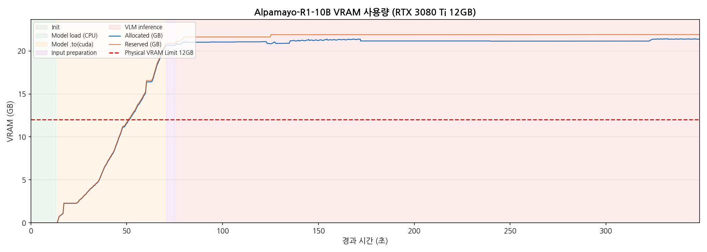
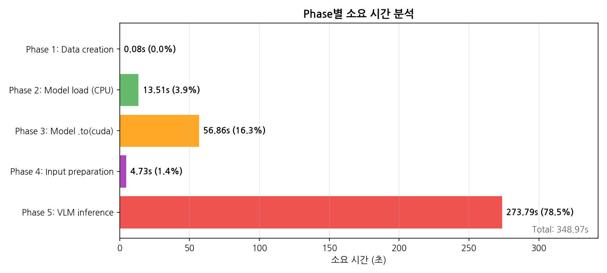
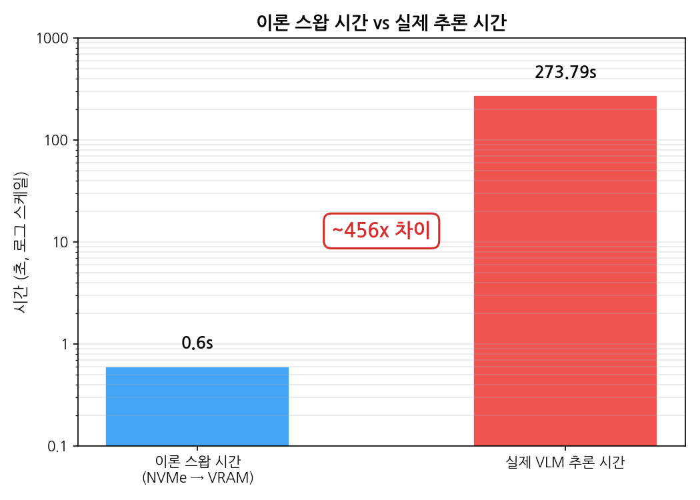
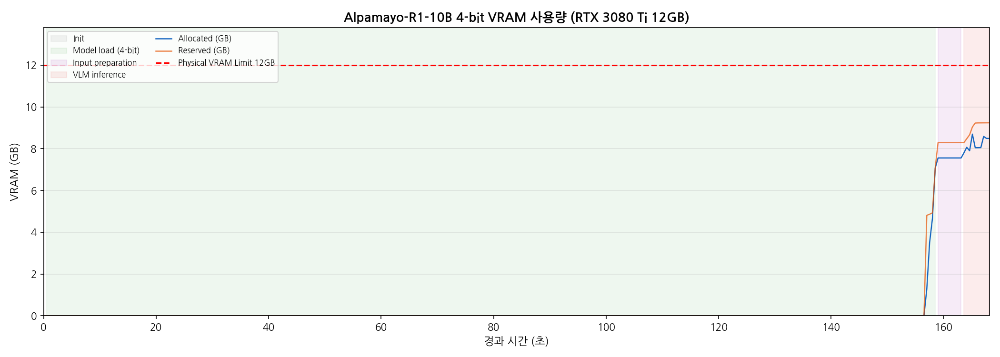
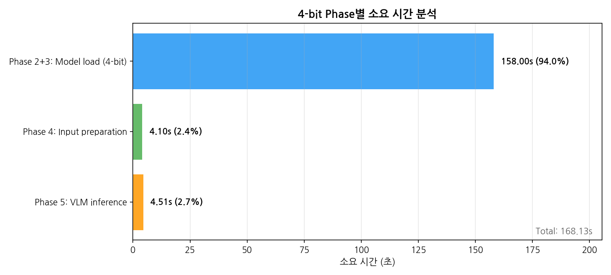
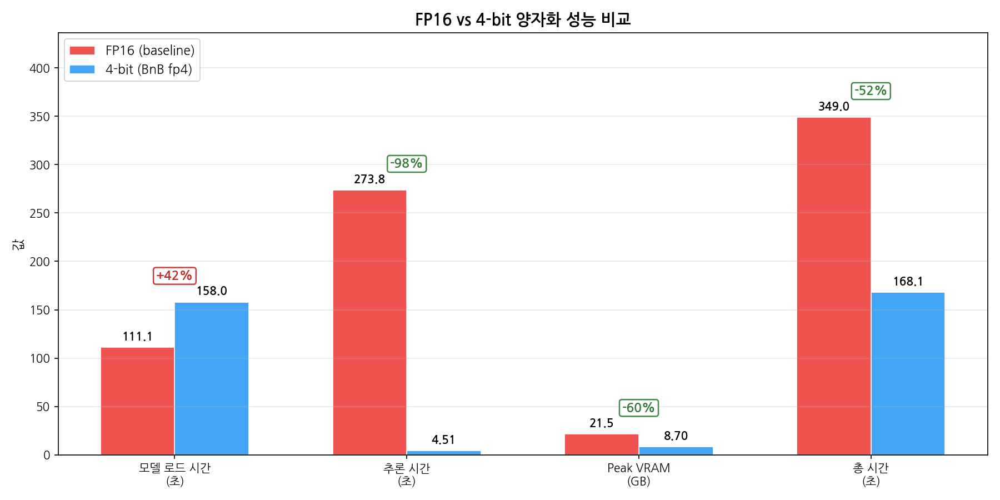

# 실험 리포트 — 2026-02-25

Alpamayo-R1-10B VRAM 최적화 연구: 환경 구축, 베이스라인 측정, 병목 분석, 경량화 비교

---

## 1. 개요

### 연구 목표

NVIDIA Alpamayo-R1-10B는 자율주행 VLA(Vision-Language-Action) 모델로, 공식 요구사항은 24GB VRAM이다. 본 연구는 이 모델을 12GB VRAM 환경(RTX 3080 Ti)에서 효율적으로 구동하는 방법을 탐색한다.

### 핵심 가설

CUDA Unified Memory를 통한 CPU-GPU 메모리 스와핑 시, 이론 대역폭(PCIe Gen3 x16, ~16GB/s) 대비 실제 성능이 수백 배 느린 **구조적 비효율**이 존재한다.

### 오늘의 목표

1. 실험 환경 구축 (WSL2 + Alpamayo 설치)
2. FP16 베이스라인 측정
3. 메모리 접근 패턴 프로파일링 및 병목 분석
4. 4-bit 양자화 모델 비교 실험

---

## 2. 실험 환경

### 하드웨어

| 항목 | 스펙 |
|------|------|
| GPU | NVIDIA RTX 3080 Ti (12GB VRAM) |
| CPU | Intel i7-10700K |
| RAM | 16GB |
| PCIe | Gen 3 x16 (~16GB/s 이론 대역폭) |

### 소프트웨어

| 항목 | 버전 |
|------|------|
| OS | WSL2 (Ubuntu on Windows) |
| Python | 3.12.12 |
| PyTorch | 2.8.0+cu128 |
| CUDA (드라이버) | 12.6 |
| 패키지 매니저 | uv 0.10.6 |

### 모델

| 모델 | 정밀도 | 크기 | 출처 |
|------|--------|------|------|
| nvidia/Alpamayo-R1-10B | FP16 (bfloat16) | ~20GB | HuggingFace (공식) |
| dwko/Alpamayo-R1-10B-4bit | BitsAndBytes fp4 | ~5GB | HuggingFace (커뮤니티) |

---

## 3. 실험 1: FP16 베이스라인 측정

### 목적

12GB VRAM에서 FP16 원본 모델의 추론 성능과 메모리 사용 패턴을 측정한다.

### 방법

- 더미 입력 데이터 사용: 4카메라 x 4프레임 x 320 x 576 해상도
- bfloat16 정밀도로 모델 로딩
- CUDA Unified Memory를 통한 자동 스와핑 (OOM 회피)
- 스크립트: `experiments/test_dummy_inference.py`

### 결과

| 지표 | 측정값 |
|------|--------|
| 모델 로드 시간 | 54.2초 |
| VRAM 할당량 | 20.65GB |
| 추론 시간 | 280.5초 |
| Peak VRAM | 21.52GB |

- Unified Memory를 통해 OOM 없이 자동 스와핑이 발생하였다.
- 이론 스왑 시간(~0.6초, 약 10GB / 16GB/s) 대비 실제 추론 시간(280초)은 약 **470배 차이**를 보였다.

---

## 4. 실험 2: 메모리 접근 패턴 프로파일링

### 목적

280초 추론 시간의 내부 구성을 시간 분해하고, VRAM 스와핑 패턴을 분석하여 병목 원인을 규명한다.

### 방법

- 5단계 시간 분해 (Phase 1~5)
- 0.5초 간격 VRAM 모니터링 (총 704 샘플)
- 스크립트: `experiments/profile_memory.py`
- 데이터: `experiments/memory_profile.csv`

### 결과

| Phase | 설명 | 소요 시간 | 비율 |
|-------|------|-----------|------|
| Phase 1 | 더미 데이터 생성 | 0.08초 | 0.0% |
| Phase 2 | CPU 모델 로드 | 13.51초 | 3.9% |
| Phase 3 | .to("cuda") 전송 | 56.86초 | 16.3% |
| Phase 4 | 입력 데이터 준비 | 4.73초 | 1.4% |
| Phase 5 | VLM 추론 | 273.79초 | 78.5% |
| **합계** | | **348.97초** | **100%** |

### 분석

- **VLM 추론(Phase 5)이 전체의 78.5%** 를 차지한다.
- 토큰당 생성 시간: ~1.07초 (정상 범위 30~50ms 대비 **20~30배 느림**).
- Phase 3(.to cuda)에서 20.65GB를 12GB 물리 VRAM에 올리면서 Unified Memory 스와핑이 시작된다.
- 핵심 병목: 매 토큰 생성 시 **무작위 페이지 스왑**이 반복 발생하여, PCIe 대역폭을 효율적으로 활용하지 못한다.
- Peak VRAM 21.52GB는 물리 VRAM(12GB)의 1.8배에 해당한다.

### 시각화

- VRAM 시계열: `../experiments/figures/memory_timeline.png`
- Phase별 시간 분해: `../experiments/figures/phase_breakdown.png`
- 이론 스왑 vs 실제 추론: `../experiments/figures/theory_vs_actual.png`

---

## 5. 실험 3: 4-bit 양자화 모델 프로파일링

### 목적

BitsAndBytes fp4 양자화 모델이 12GB VRAM 이내에서 동작하는지 확인하고, FP16 대비 성능을 비교한다.

### 방법

- dwko/Alpamayo-R1-10B-4bit (BitsAndBytes fp4 양자화) 사용
- 동일 더미 입력 데이터 (4카메라 x 4프레임 x 320 x 576)
- 스크립트: `experiments/profile_memory_4bit.py`
- 데이터: `experiments/memory_profile_4bit.csv`

### 결과

| Phase | 설명 | 소요 시간 | 비율 |
|-------|------|-----------|------|
| Phase 2+3 | 모델 로드 (초회 HF 캐싱 포함) | 158.80초 | 94.5% |
| Phase 4 | 입력 데이터 준비 | 4.31초 | 2.6% |
| Phase 5 | VLM 추론 | 4.91초 | 2.9% |
| **합계** | | **168.11초** | **100%** |

| 지표 | 측정값 |
|------|--------|
| Peak VRAM | 8.87GB |
| VRAM 여유 | 3.13GB (12GB 이내) |

- 4-bit 모델은 12GB VRAM 이내에서 **스와핑 없이** 완전히 동작한다.
- VLM 추론이 4.91초로 FP16(273.79초) 대비 극적으로 개선되었다.
- 현재 병목은 모델 로드 시간(158.80초)이며, 이는 초회 HuggingFace 캐싱이 포함된 수치이다.

### 시각화

- VRAM 시계열: `../experiments/figures/memory_timeline_4bit.png`
- Phase별 시간 분해: `../experiments/figures/phase_breakdown_4bit.png`

---

## 6. FP16 vs 4-bit 비교 분석

| 지표 | FP16 | 4-bit | 변화 |
|------|------|-------|------|
| VLM 추론 시간 | 273.79초 | 4.91초 | **-98% (55.8x 개선)** |
| Peak VRAM | 21.52GB | 8.87GB | **-59%** |
| 모델 로드 시간 | 111.06초 | 158.80초 | +42% |
| 총 소요 시간 | 348.97초 | 168.11초 | **-52%** |
| VRAM 스와핑 | 발생 (Unified Memory) | 없음 | - |
| 12GB VRAM 적합성 | 부적합 (21.52GB 필요) | 적합 (8.87GB) | - |

### 핵심 관찰

- FP16의 추론 시간 273초는 모델 연산이 아닌 **메모리 스왑 오버헤드**가 절대적 원인이다.
- 4-bit 양자화로 모델 크기를 12GB VRAM 이내로 줄이면 스와핑이 제거되어 추론이 55.8배 빨라진다.
- 4-bit의 모델 로드 시간(158초)은 FP16(111초)보다 42% 길지만, 이는 초회 캐싱 비용이 포함된 수치이다.

### 시각화

---

## 7. 결론 및 인사이트

1. **FP16 모델의 273초 추론 시간은 연산이 아닌 메모리 스왑 오버헤드이다.**
   - 이론 스왑 시간(0.6초) 대비 실제(273초)의 ~456배 격차는, 매 토큰 생성 시 발생하는 무작위 페이지 스왑 패턴이 원인이다.
   - Unified Memory의 페이지 단위 스와핑은 순차적 대량 전송이 아닌, 산발적 소량 전송을 반복하여 PCIe 대역폭을 극히 비효율적으로 사용한다.

2. **4-bit 양자화로 12GB VRAM 이내 동작이 가능하다.**
   - Peak VRAM 8.87GB로 12GB 물리 VRAM 이내에서 완전 동작한다.
   - VLM 추론이 4.91초로 FP16 대비 55.8배 개선되었다.

3. **현재 병목은 모델 로드 시간이다.**
   - 4-bit 모델의 로드 시간 158초는 전체의 94.5%를 차지한다.
   - 초회 HuggingFace 캐싱이 포함되어 있으므로, 캐싱 이후 재실행 시 개선이 예상된다.

4. **이론 스왑 시간(0.6초) vs 실제(273초) 격차의 원인은 무작위 페이지 스왑 패턴이다.**
   - Unified Memory는 필요한 페이지를 요청 시점에 개별 전송하므로, 연속 메모리 블록의 일괄 전송 대비 극히 비효율적이다.
   - 이는 `device_map="auto"` 등을 통한 계획적 레이어 분배로 개선 가능성이 있다.

---

## 8. 향후 계획

| 순서 | 실험 | 목적 |
|------|------|------|
| 1 | `device_map="auto"` 레이어 분배 테스트 | 계획적 offloading vs 무작위 스왑 성능 비교 |
| 2 | 4-bit 모델 캐싱 후 재실행 | 순수 모델 로드 시간 측정 (HF 캐싱 비용 제거) |
| 3 | FP16 vs 4-bit 출력 궤적 정확도 비교 | 양자화로 인한 정확도 손실 정량화 |
| 4 | KV cache 최적화 탐색 | 추론 중 메모리 효율 추가 개선 |

---

## 참고

- 연구 방향성: [research.md](research.md)
- 설치 가이드: [alpamayo-setup-guide.md](alpamayo-setup-guide.md)
- 실험 상세: [experiments/README.md](../experiments/README.md)
- 작업 로그: [2026-02-25.md](../work-log/2026-02-25.md)
