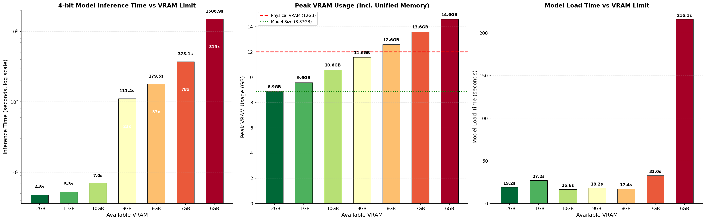
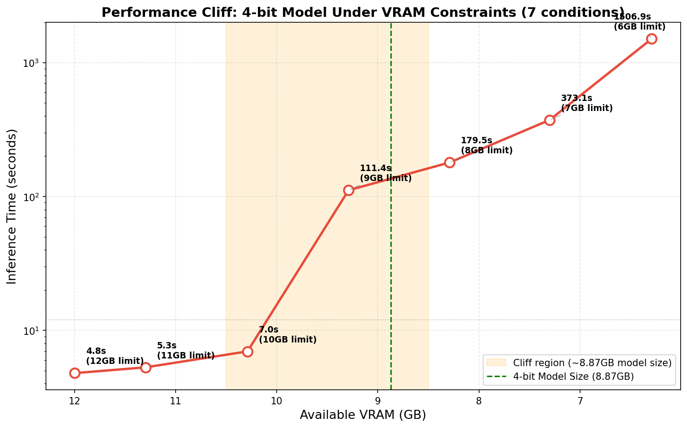
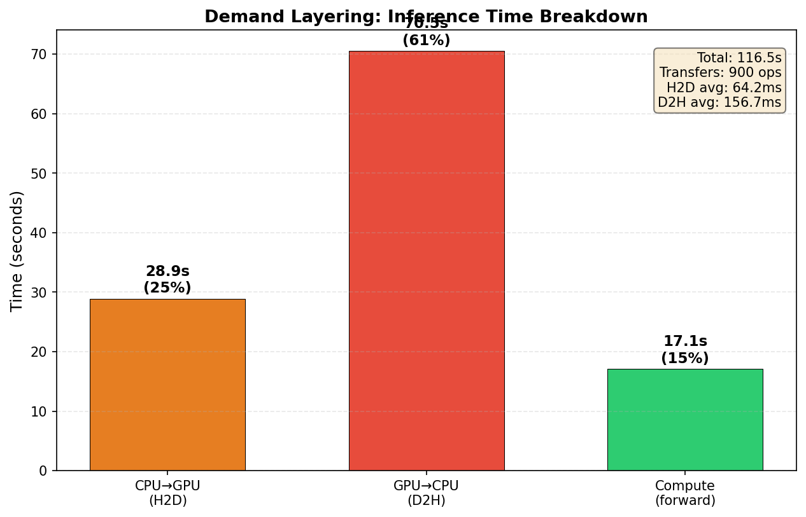
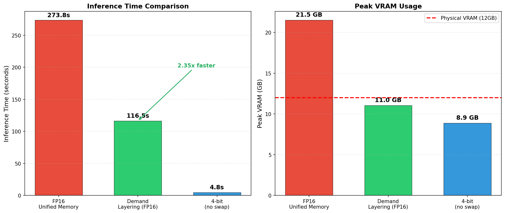

# Alpamayo-R1 VRAM 최적화 연구 보고서

> 작성일: 2026-02-26
> 환경: NVIDIA GeForce RTX 3080 Ti (12 GB VRAM), WSL2, PCIe Gen3 x16

---

## 1. Alpamayo-R1 VRAM 사용량 분석

### 1.1 모델 구조

Alpamayo-R1-10B은 11.08B 파라미터, BF16 기준 약 22.16GB(실측 Peak 21.52GB)의 VLA(Vision-Language-Action) 모델이다.

| 모듈 | 레이어 수 | 크기 (BF16) | 비율 |
|------|-----------|-------------|------|
| Vision Encoder | — | 1.15 GB | 5.2% |
| VLM (Qwen3-VL-8B) | 36 | 15.17 GB | 68.5% |
| VLM LM Head | — | 1.28 GB | 5.8% |
| Expert (Trajectory Decoder) | 36 | 4.56 GB | 20.6% |
| **합계** | — | **~22.16 GB** | **100%** |

### 1.2 추론 시 VRAM 점유 비율

| 분류 | 구성요소 | 크기 | 비율 |
|------|---------|------|------|
| **정적 (모델 파라미터)** | VLM Language Model | 15.17 GB | 63.7% |
| | Vision Encoder | 1.15 GB | 4.8% |
| | VLM LM Head | 1.28 GB | 5.4% |
| | Expert (Decoder) | 4.56 GB | 19.1% |
| | **소계** | **22.16 GB** | **93.0%** |
| **동적 (추론 중)** | KV Cache (~4,470 토큰) | 0.56 GB | 2.4% |
| | Activation + Overhead | 1.10 GB | 4.6% |
| | **소계** | **1.66 GB** | **7.0%** |
| **합계** | | **~23.82 GB** | **100%** |
| **측정 Peak** | | **21.52 GB** | |

### 1.3 일반 LLM과의 KV Cache 비교

일반 LLM에서 KV Cache는 긴 컨텍스트에서 총 메모리의 **30-50%+** 를 차지하여 메모리 병목의 핵심 요인이다.
Alpamayo는 이와 근본적으로 다르다:

| | 일반 LLM (예: Llama-70B, 4K 컨텍스트) | Alpamayo-R1 |
|---|---|---|
| KV Cache 비중 | 총 메모리의 **30-50%+** | 총 메모리의 **2.4%** |
| 원인 | 긴 컨텍스트 + Full MHA | GQA + 짧은 CoT (~15토큰) |
| KV Cache 크기 | 수~수십 GB | 0.56 GB |
| 메모리 병목 | KV Cache + 파라미터 | **파라미터 단독 (93%)** |

**핵심 시사점**: Alpamayo에서는 KV Cache 최적화가 아닌, **파라미터 자체의 메모리 최적화**가 핵심 과제이다.
특히 VLM 단독 15.17GB > 12GB VRAM이므로, 레이어 단위 파라미터 스와핑이 필수적이다.

### 1.4 시각화


---

## 2. 스왑 오버헤드 분석

### 2.1 Vanilla Alpamayo (BF16, Unified Memory)

**실험 환경**: RTX 3080 Ti 12GB, WSL2, PyTorch 2.8.0+cu128

모델 전체(~22GB)를 GPU에 로드하면 12GB VRAM을 초과하는 부분이 CUDA Unified Memory를 통해 자동으로 CPU RAM에 배치된다.

**실행 결과: 273.79s** (이론 최적 ~5s 대비 **55배 느림**)

**느린 이유 분석:**

1. **On-Demand 페이지 폴트**: 모델 ~22GB > 12GB VRAM → Unified Memory가 4KB~2MB 단위로 page fault 발생
2. **PCIe 대역폭 효율 저하**: 소규모 페이지 단위 전송으로 유효 대역폭이 이론치 대비 크게 감소
3. **매 토큰 전체 VLM 읽기**: 토큰 생성마다 VLM 15.17GB 파라미터 전체를 읽어야 함 (256토큰 × 15.17GB)
4. **대역폭 격차**: VRAM 내부 912 GB/s vs PCIe Gen3 8.5 GB/s = **107배 격차**

**이론 최적값 산출 (VRAM bandwidth-bound, 스왑 없는 경우):**

| 단계 | 읽기량 | 반복 | 시간 |
|------|--------|------|------|
| VLM (토큰 생성) | 16.45 GB/토큰 | 256회 | 4.62s |
| Expert (디퓨전) | 4.56 GB/스텝 | 10회 | 0.05s |
| Vision + KV Cache 등 | | | ~0.3s |
| **합계** | | | **≈ 5.0s** |

> 연산 시간(0.44ms/토큰)은 읽기 시간(18ms/토큰)의 2.4%로 무시 가능. **Memory-bandwidth-bound** 워크로드.

### 2.2 4-bit 양자화 + VRAM 제한 실험

4-bit 양자화 모델(dwko/Alpamayo-R1-10B-4bit)을 사용하여 VRAM 가용량에 따른 성능 변화를 측정했다.
dummy 텐서로 VRAM을 선점하여 사용 가능 VRAM을 제한하는 방식이다.

- **4-bit 모델 크기**: 8.87 GB (Peak VRAM, 12GB 제한 시)

**실험 결과:**

| VRAM 제한 | Dummy 크기 | 가용 VRAM | 추론 시간 | Peak VRAM | 비고 |
|-----------|-----------|-----------|----------|-----------|------|
| 12 GB | 0 GB | 12.00 GB | 4.79s | 8.87 GB | Baseline |
| 11 GB | 0.7 GB | 11.30 GB | 5.29s | 9.59 GB | |
| 10 GB | 1.7 GB | 10.29 GB | 6.96s | 10.59 GB | |
| 9 GB | 2.7 GB | 9.29 GB | 111.36s | 11.58 GB | **Performance Cliff** |
| 8 GB | 3.7 GB | 8.29 GB | 179.46s | 12.59 GB | |
| 7 GB | 4.7 GB | 7.30 GB | 373.05s | 13.61 GB | 재측정 완료 |
| 6 GB | 5.7 GB | 6.29 GB | 1506.88s | 14.59 GB | |

**Performance Cliff 분석:**

- **10GB → 9GB 구간에서 16배 급감** (6.96s → 111.36s)
- 가용 VRAM이 모델 크기(8.87GB)를 밑돌기 시작하면 Unified Memory 스왑 발생
- 스왑 발생 시 성능이 불연속적으로 급락하는 cliff 현상





---

## 3. Demand Layering 적용 결과

### 3.1 Demand Layering 논문 (RTSS 2022)

RTSS 2022 논문 "Demand Layering for Real-Time DNN Inference with Minimized Memory Usage"는 DNN 추론 시 모델 파라미터를 레이어 단위로 로딩/실행하는 기법을 제안한다.

**원 논문의 3-Stage Synchronous Pipeline:**

```
Layer i:    [ Read_i  ][ Copy_i  ][ Kernel_i  ]
Layer i+1:             [ Read_i+1 ][ Copy_i+1  ][ Kernel_i+1  ]
Layer i+2:                        [ Read_i+2  ][ Copy_i+2  ][ Kernel_i+2  ]
```

- **Read**: SSD → CPU staging buffer (DMA)
- **Copy**: CPU staging → GPU 메모리 (PCIe)
- **Kernel**: GPU에서 레이어 실행

**원 논문 vs 우리 환경:**

| | 원 논문 (RTSS 2022) | 본 연구 |
|---|---|---|
| GPU | iGPU (통합 메모리) | dGPU (RTX 3080 Ti, 12GB) |
| 스토리지 | NVMe SSD | CPU RAM |
| 파이프라인 | 3-Stage (Read→Copy→Kernel) | **Sequential** (H2D→Execute→D2H) |
| 대상 모델 | 단일 DNN | VLA (Vision-Language-Action) |

> 우리 구현은 원 논문의 파이프라인이 아닌 **Sequential Architecture**에 해당: 레이어별 동기식 H2D → Execute → D2H (파이프라이닝 없음).

### 3.2 실험 결과

구현: `research/06-demand-layering-impl/demand_layering.py`
- VLM 36개 레이어 중 30개를 CPU로 오프로드, 6개는 GPU 상주
- `register_forward_pre_hook()` / `register_forward_hook()`으로 동적 로드/언로드

| 항목 | 값 |
|------|----|
| **추론 시간** | **116.51s** |
| Peak VRAM | 11.03 GB |
| GPU 상주 | 9.86 GB |
| H2D 전송 | 450회, 총 28.9s (평균 64.23 ms/layer) |
| D2H 전송 | 450회, 총 70.5s (평균 156.72 ms/layer) |
| vs Baseline (273.79s) | **2.35x 빠름** |

### 3.3 한계 분석

추론 시간 116.51s의 구성:

```
H2D 전송:  28.9s  (24.8%)
D2H 전송:  70.5s  (60.5%)  ← 불필요한 오버헤드
계산:      ~17.1s (14.7%)
────────────────────────────
합계:      116.51s
```

**핵심 문제점:**

1. **추론 시간의 85%가 데이터 전송** (H2D 28.9s + D2H 70.5s = 99.4s)
2. **D2H가 H2D보다 2.4x 느림** (평균 156.72ms vs 64.23ms)
3. **D2H는 불필요**: CPU에 파라미터 원본이 보존되어 있으므로, GPU 메모리 해제(free)만 하면 됨
4. **D2H 70.5s는 완전히 제거 가능한 오버헤드** — 추론 시간의 60%가 낭비
5. **동기식 전송**으로 PCIe 유휴 시간 多 — 계산과 전송이 겹치지 않음





---

## 4. 스왑 방법론 비교

### 실행시간 산출 근거

- VLM 36레이어 중 30개 오프로드 × 15 VLM passes = **450 transfers**
- 레이어당 크기: ~386 MB (BF16), ~0.193 GB
- Per-layer H2D (현재 측정): 64.23 ms
- Per-layer compute (추정): ~37 ms (17.1s ÷ 450)

### 4.1 방법 1: 레이어 단위 동기 스왑 (Synchronous On-Demand)

**개념:** 개별 Transformer 레이어를 forward hook으로 GPU↔CPU 간 동기식 이동.

```
Layer N:  [H2D 64ms][Compute 37ms][D2H 157ms]
Layer N+1:                                    [H2D 64ms][Compute 37ms][D2H 157ms]
→ 레이어당 ~258ms, 전체: 116.51s
```

**성능:**

| 조건 | 추론 시간 | 비고 |
|------|----------|------|
| 현재 구현 (D2H 포함) | **116.51s** | 실측 |
| D2H 제거 시 | **~46s** | H2D 28.9s + compute 17.1s |

**구현 상태:** 완료 (`research/06-demand-layering-impl/demand_layering.py`)

### 4.2 방법 2: 최적 청크 전송 (2-8MB Chunked Transfer)

**개념:** 레이어를 2-8MB 청크로 분할 + Pinned Memory로 PCIe 대역폭 극대화.

```
현재:  단일 전송, Pageable    → 유효 대역폭 7.77 GB/s
개선:  2-8MB 청크, Pinned     → 유효 대역폭 12.4 GB/s (1.6x)
```

| 청크 크기 | 유효 대역폭 | 비고 |
|-----------|-------------|------|
| 2-8 MB | **12.16-12.41 GB/s** | 최적 구간 |
| 512 MB (단일) | 7.77 GB/s | 기준 |
| PCIe Gen3 이론 | 15.75 GB/s | 실측 79% 활용 |

**성능:** H2D 28.9s / 1.6 ≈ 18s + compute 17.1s ≈ **~35s**

**구현 상태:** 벤치마크 완료 (`research/03-swap-optimization/`)

### 4.3 방법 3: 모듈 단위 스왑 → 불가능

**개념:** Vision / VLM / Expert를 모듈 통째로 스왑.

**검증 결과:**

```
Vision Encoder:  1.15 GB  → ✓  GPU 적재 가능
VLM:            15.17 GB  → ✗  12GB 초과, 모듈 단위 불가
Expert:          4.56 GB  → ✓  GPU 적재 가능
```

**VLM 단독 15.17GB > 12GB VRAM** — 순수 모듈 단위 스왑은 불가능.

### 4.4 교수님 아이디어: 2-Stage 스와핑 분석

교수님이 제안하신 비전-프리필과 디코딩을 2-stage로 나누어 VRAM을 절감하는 아이디어에 대한 분석:

**A. 모듈 단위 2-Stage**

- Stage 1: Vision + VLM → GPU
- Stage 2: Expert → GPU
- **문제**: VLM 단독 15.17GB > 12GB → **불가능**

**B. 레이어 단위 2-Stage** (수정 적용)

- **Stage 1**: VLM 레이어별 스왑으로 prefill + token generation 수행 (Expert는 CPU 대기)
- **Stage 2**: Expert 전체를 GPU에 로드 (4.56GB, 적재 가능) → diffusion 실행

이론 시간: Stage 1 (VLM 레이어별 스왑) + Stage 2 (Expert 로드 0.5s + diffusion ~0.05s)

> **결론**: 레이어 단위 2-stage는 유효하며, **방법 1의 현재 구현이 이미 이 구조에 해당**한다.
> (VLM은 레이어별 스왑, Expert는 GPU 상주로 처리)

### 4.5 방법 4: 비동기 2-Stream 파이프라인 (Prefetch + Free)

**핵심 통찰 — D2H는 불필요:**

파라미터 오프로딩 추론에서 GPU→CPU 복사(D2H)는 필요 없다.
파라미터 원본은 CPU 메모리에 이미 존재하므로, GPU 메모리를 **해제(free)하기만 하면 된다.**

```
D2H가 필요한 경우:   Activation 저장 (학습), KV Cache 보존
D2H가 불필요한 경우: 파라미터 오프로딩 (추론) ← 우리 시나리오
```

**개념:** 2개의 CUDA 스트림으로 계산과 H2D prefetch를 비동기 오버랩.

```
시간 →
Compute Stream: [Layer N 계산]     [Layer N+1 계산]   [Layer N+2 계산]
H2D Stream:     [Layer N+1 로드]   [Layer N+2 로드]   [Layer N+3 로드]
                 + Layer N-1 free   + Layer N free     + Layer N+1 free
```

**이론 시간 산출:**

| 시나리오 | Per-layer | 450 layers | 총 시간 |
|----------|-----------|------------|---------|
| 기본 비동기 (Pageable) | max(64ms, 37ms) = 64ms | 450 × 64ms | **~29s** |
| + Chunked (12.4 GB/s) | max(31ms, 37ms) = 37ms | 450 × 37ms | **~17s** |

**선행 연구 대비 차별점:**

| 시스템 | 연도 | H2D Prefetch | D2H 사용 이유 | 대상 |
|--------|------|:--------:|------|------|
| SwapAdvisor (ASPLOS) | 2020 | O | Activation 저장 (학습) | 학습 |
| Demand Layering (RTSS) | 2022 | O | SSD writeback | RT 추론 |
| FlexGen (ICML) | 2023 | O | KV Cache + Activation offload | 배치 추론 |
| PIPO | 2025 | O | KV Cache saving | 소비자 추론 |
| **본 연구** | **2026** | **O** | **불필요 (free만)** | **VLA 추론** |

---

## 5. 이론적 실행시간 비교 종합

| 방법 | 이론 추론 시간 | vs Baseline (273.79s) | 비고 |
|------|---------------|----------------------|------|
| Baseline (BF16 Unified Memory) | 273.79s | 1x | 실측 |
| 방법 1 (동기 스왑, D2H 포함) | 116.51s | **2.35x** | 실측 |
| 방법 1 (D2H 제거) | ~46s | **6.0x** | D2H만 제거 |
| 방법 2 (청크 + D2H 제거) | ~35s | **7.8x** | Pinned + 2-8MB 청크 |
| 방법 3 (모듈 단위) | N/A | — | VLM > 12GB, 불가 |
| 방법 4 (비동기 2-Stream) | ~29s | **9.4x** | 비동기 오버랩 |
| **방법 4 + 2 (비동기 + 청크)** | **~17s** | **16.1x** | **최선** |
| 이론 최적 (스왑 없음) | ~5s | 55x | 24GB+ GPU 필요 |

> **현실적 목표**: 방법 4+2 (비동기 + 청크)로 **273.79s → ~17s**, 16배 가속.
> 이론 최적(~5s) 대비 3.4배 차이는 PCIe Gen3 대역폭의 구조적 한계.

---

## 6. WSL2 환경 오버헤드

현재 실험 환경은 네이티브 Linux가 아닌 WSL2 위에서 동작한다.

### 6.1 측정된 WSL2 오버헤드

| 항목 | WSL2 (현재) | 네이티브 Linux (예상) | 차이 |
|------|------------|---------------------|------|
| Pageable D2H 대역폭 | 2.48 GB/s | ~11 GB/s | **4.5배 느림** |
| Pinned D2H 대역폭 | 11.8 GB/s | ~12+ GB/s | 유사 |
| Pageable H2D 대역폭 | 7.77 GB/s | ~8+ GB/s | 유사 |
| per-transfer 고정 오버헤드 | 0.36 ms | ~0.05 ms | **7배** |
| cudaMemPrefetchAsync(CPU) | **미지원** | 지원 | — |

### 6.2 의미

- WSL2의 Pinned memory 대역폭은 네이티브와 유사 → **Pinned 기반 구현에서는 영향 적음**
- 방법 4 (비동기 파이프라인)는 Pinned memory를 사용하므로 WSL2 오버헤드 영향 최소
- 최적화 방향성(pinned + 비동기 + 레이어별) 탐색에는 WSL2에서도 유효
- 최종 성능 평가는 네이티브 Linux에서 수행하는 것이 바람직

---

## 참고 문헌

- Demand Layering — Bae et al., RTSS 2022 (arXiv:2210.04024)
- SwapAdvisor — Huang et al., ASPLOS 2020
- FlexGen — Sheng et al., ICML 2023 (arXiv:2303.06865)
- PIPO — 2025 (arXiv:2504.03664)
- vDNN — Rhu et al., 2016 (arXiv:1602.08124)
