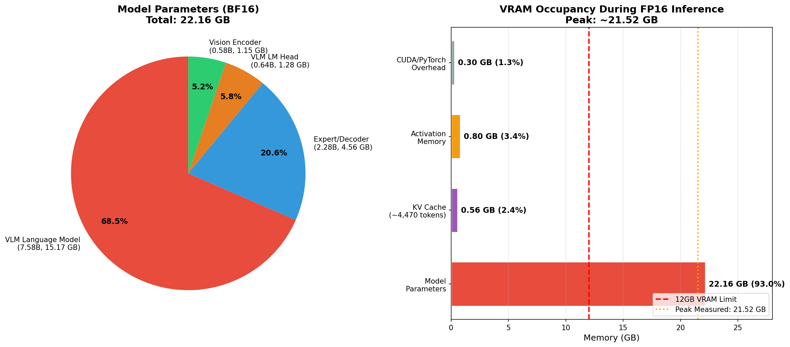
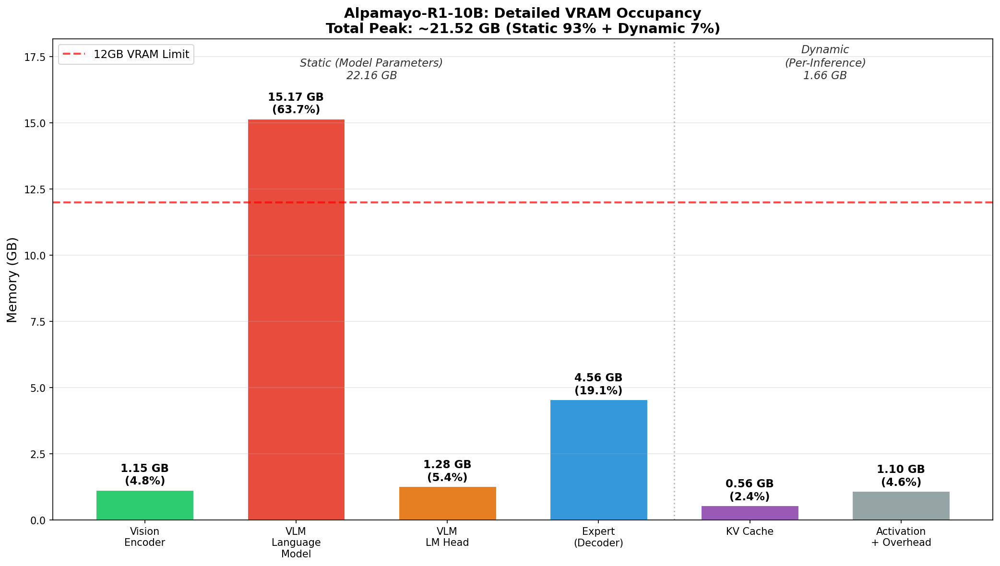
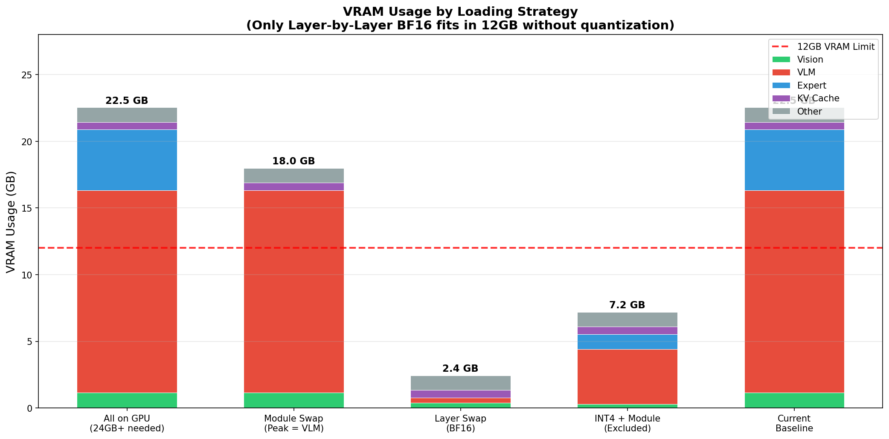

# 교수님 면담 자료 #1

> 작성일: 2026-02-25

---

## 교수님 아이디어: 2-Stage 모듈 스와핑

### 아이디어 내용
- 비전-프리필 과정과 디코딩 과정을 **2-stage로 나눠서 VRAM에 로딩/언로딩**
- 사용하는 모듈만 VRAM에 올리고, 끝나면 내림
- 이렇게 하면 VRAM 사용량을 절반으로 줄일 수 있지 않을까?

### 실제 적용 시 효과 (Alpamayo 기준)

| 단계 | 모듈 | 크기 (BF16) |
|------|------|-------------|
| 1 | Vision Encoder | 1.15 GB |
| 2 | VLM (LLM) | 15.17 GB |
| 3 | Diffusion Decoder | 4.56 GB |
| **전체 동시 로드** | | **~21 GB** |
| **모듈 스와핑 시 Peak** | max(1.15, 15.17, 4.56) | **~15.17 GB** |

→ 21GB → 15.17GB로 감소. **약 28% 절감** (절반까지는 아님)

### 이미 존재하는 메커니즘: `device_map="auto"`

이 아이디어는 HuggingFace Accelerate 라이브러리의 `device_map="auto"` 기능으로 **이미 자동화되어 있음**.

```python
model = AutoModelForCausalLM.from_pretrained("model_name", device_map="auto")
```

**device_map="auto"의 동작:**
1. 모델 로드 시 VRAM 용량을 확인
2. VRAM에 들어가는 레이어는 GPU에 배치
3. 초과분은 CPU RAM에 배치 (그래도 부족하면 디스크)
4. 추론 시 CPU에 있는 레이어를 **실행 차례에 GPU로 이동 → 완료 후 CPU로 반환**

### 교수님 아이디어와 device_map="auto"의 차이

| | 교수님 아이디어 | device_map="auto" |
|---|---|---|
| 스와핑 단위 | 모듈 단위 (Vision / VLM / Diffusion) | 레이어 단위 (개별 Transformer 레이어) |
| 구현 | 수동 (명시적 `.to(cuda)` / `.to(cpu)`) | 자동 (Accelerate 라이브러리) |
| 개념 | 동일 — "쓸 때만 올리고 내린다" | 동일 — "쓸 때만 올리고 내린다" |

→ **핵심은 같음**: 필요할 때만 VRAM에 올리고, 끝나면 내리는 방식. device_map이 이를 레이어 단위로 더 세밀하게 자동 수행.

### 단, Alpamayo에서는 device_map="auto"가 동작하지 않음

**실패 원인**: Alpamayo의 `fuse_traj_tokens()` 커스텀 연산
- VLM 출력 텐서와 trajectory 토큰 테이블을 `masked_scatter`로 합치는 과정
- device_map이 텐서를 GPU/CPU에 분산 배치하면 **디바이스 불일치 에러** 발생
- 실제 테스트에서 CUDA assertion error 확인 (연구 방향 1 실험)

### 그래서 우리 연구가 필요한 이유

1. 기존 device_map="auto"는 Alpamayo 비호환 → **커스텀 오프로딩 구현 필요**
2. 모듈 단위 스와핑만으로는 VLM(15.17GB) > 12GB VRAM → **레이어 단위 스와핑도 필요**
3. 단순 스와핑은 느림 (Unified Memory 기반 273초) → **명시적 전송 + 파이프라이닝 최적화 필요**

→ 모듈 스와핑(교수님 아이디어) + 레이어 스와핑 + pinned memory + 비동기 프리페치를 **조합한 커스텀 구현**이 연구의 핵심

---

## 스왑 최적화의 근본적 한계 분석

### FP16 이론적 최적 추론 시간 (스왑 없는 경우)

GPU 메모리 대역폭(912 GB/s)으로부터 산출:

| 단계 | 읽기량 | 반복 | 시간 |
|------|--------|------|------|
| VLM (토큰 생성) | 16.45 GB/토큰 | 256회 | 4.62s |
| Expert (디퓨전) | 4.56 GB/스텝 | 10회 | 0.05s |
| Vision + KV Cache 등 | | | ~0.3s |
| **합계** | | | **≈ 5.0s** |

연산 시간(0.44ms/토큰)은 읽기 시간(18ms/토큰)의 2.4%로 무시 가능. (Memory-bandwidth-bound)

### VRAM 대역폭 vs PCIe 대역폭 격차

| 경로 | 대역폭 | 토큰당 9.5GB 스왑 | 256토큰 |
|------|--------|-----------------|--------|
| VRAM 내부 | 912 GB/s | 10ms | 2.6s |
| PCIe Gen3 (pinned) | 8.5 GB/s | 1,118ms | 286s |
| **격차** | **107배** | | |

### 파이프라이닝이 효과 없는 이유

```
실제 상황 (전송 >> 실행):
  전송: [=============================================]  45ms/레이어
  실행:                                               [=] 0.5ms/레이어
  → 44.5ms 대기 불가피
```

레이어 실행(0.5ms)이 전송(45ms)보다 90배 빠름 → 전송을 연산으로 은닉 불가능

### 결론: 성능 한계선

| 전략 | 추론 시간 | 이론 최적 대비 |
|------|----------|--------------|
| 이론 최적 (스왑 없음, ≥24GB GPU) | ~5s | 1x |
| **최선의 스왑 최적화 (12GB)** | **~80-150s** | **16-30x** |
| 현재 Baseline (Unified Memory) | 273.79s | 55x |

**스왑 최적화로 273초 → 80~150초 개선은 가능하나, 5초에는 도달 불가능.**

이 격차를 해소하려면:
1. VRAM 증설 (24GB+ GPU)
2. 모델 축소 (양자화 — 연구에서 배제)
3. 더 빠른 인터커넥트 (PCIe Gen5: 2배, NVLink: 10배+)

→ 12GB VRAM + PCIe Gen3 환경에서 스왑 없는 성능에 근접하는 것은 **구조적으로 불가능**. 이것이 연구의 현실적 한계선.

---

## WSL2 환경에 의한 추가 오버헤드

현재 실험 환경은 **네이티브 Linux가 아닌 WSL2** 위에서 동작한다. WSL2는 GPU 접근 시 추가적인 오버헤드를 발생시킨다.

### 측정된 WSL2 오버헤드

| 항목 | WSL2 (현재) | 네이티브 Linux (예상) | 차이 |
|------|------------|---------------------|------|
| Pageable D2H 대역폭 | 2.48 GB/s | ~11 GB/s | **4.5배 느림** |
| Pinned D2H 대역폭 | 11.8 GB/s | ~12+ GB/s | 유사 |
| Pageable H2D 대역폭 | 7.77 GB/s | ~8+ GB/s | 유사 |
| per-transfer 고정 오버헤드 | 0.36 ms | ~0.05 ms | **7배** |
| cudaMemPrefetchAsync(CPU) | **미지원** | 지원 | — |

### WSL2가 미치는 영향

1. **Pageable D2H 비정상 감속**: Unified Memory의 D2H(GPU→CPU) 전송이 pinned 대비 4.5배 느림. 네이티브 Linux에서는 이 감속이 없음
2. **per-transfer 오버헤드**: 매 전송마다 0.36ms 고정 비용 → 레이어별 스와핑에서 수백 번 누적
3. **cudaMemPrefetchAsync(CPU) 미지원**: CUDA Managed Memory의 명시적 프리페치 API가 WSL2에서 동작하지 않음 → 프리페치 최적화 경로 차단

### 의미

- 현재 273.79초 중 일부는 WSL2 고유 오버헤드
- 네이티브 Linux로 전환 시 **약 40% 성능 개선** 예상 (특히 Pageable D2H 정상화)
- 단, WSL2의 pinned memory 대역폭은 네이티브와 유사하므로 pinned 기반 구현에서는 영향 적음
- **결론**: 최종 성능 평가는 네이티브 Linux에서 수행하는 것이 바람직하나, 최적화 방향성(pinned + 비동기 + 레이어별) 탐색에는 WSL2에서도 유효

---

## VRAM 점유 비율 분석

### 추론 시 VRAM 구성

| 분류 | 구성요소 | 크기 | 비율 |
|------|---------|------|------|
| **정적 (모델 파라미터)** | VLM Language Model | 15.17 GB | 63.7% |
| | Vision Encoder | 1.15 GB | 4.8% |
| | VLM LM Head | 1.28 GB | 5.4% |
| | Expert (Decoder) | 4.56 GB | 19.1% |
| **동적 (추론 중)** | KV Cache (~4,470 토큰) | 0.56 GB | 2.4% |
| | Activation + Overhead | 1.10 GB | 4.6% |
| **합계** | | **~23.82 GB** | **100%** |
| **측정 Peak** | | **21.52 GB** | |

### 핵심 관찰

- **모델 파라미터가 93%** — VRAM의 대부분은 가중치가 차지
- **KV Cache는 2.4%** — GQA(Grouped Query Attention) 덕분에 KV Cache는 의외로 작음 (Full MHA 대비 1/4)
- **Activation은 4.6%** — SDPA(Scaled Dot-Product Attention) 적용으로 O(n²) 메모리 회피
- **VLM 단독 15.17GB > 12GB** → 모듈 스와핑만으로 해결 불가, 레이어 단위 스와핑 필수

### 시각화





---
