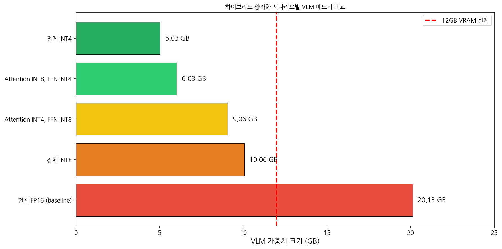
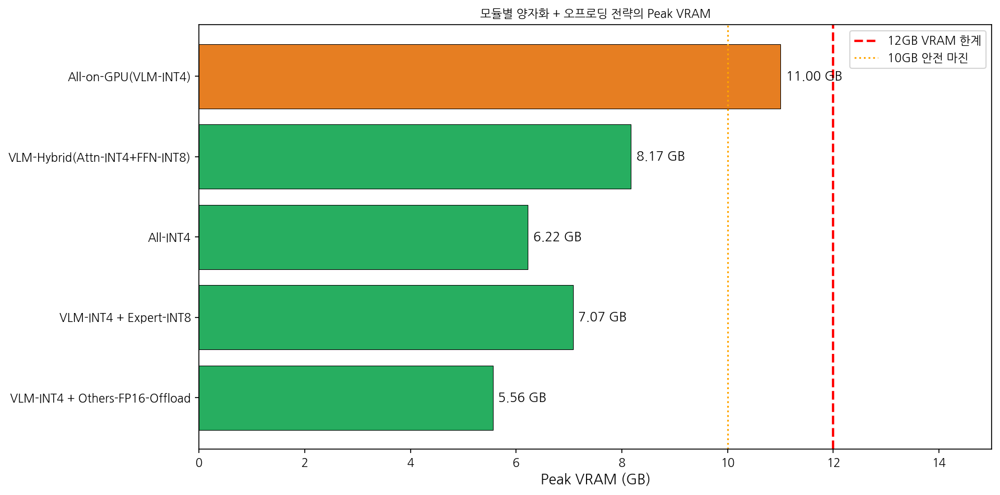
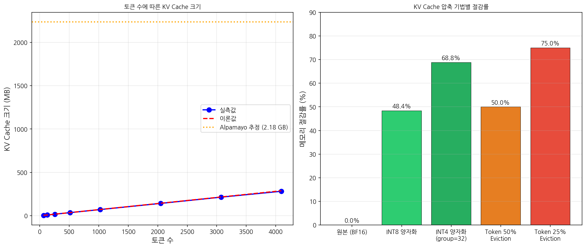
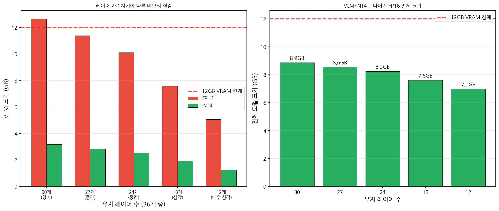
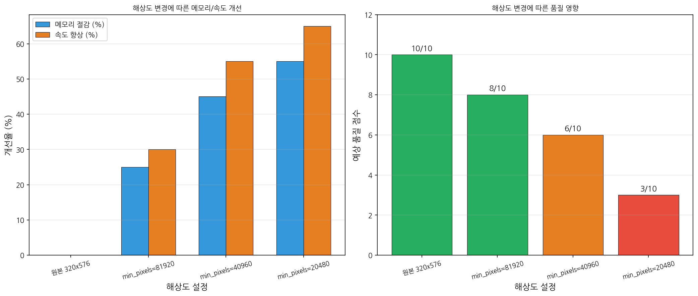
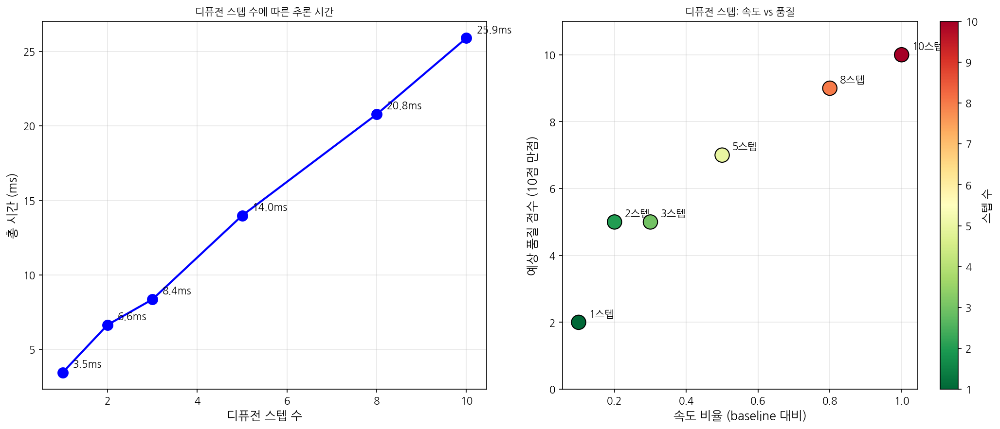
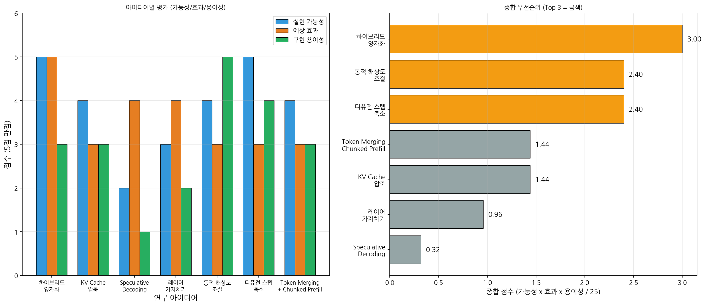

# 연구 방향 4: 창의적이고 새로운 연구 주제 탐색 및 가능성 검증 보고서

> 실험일: 2026-02-25
> 환경: NVIDIA GeForce RTX 3080 Ti (12 GB VRAM), WSL2 (Kernel 6.6.87.1)
> 모델: nvidia/Alpamayo-R1-10B (BF16 = ~20.88 GB)
> Python: `/home/seungwoo/workspace/alpamayo/ar1_venv/bin/python`

---

## 0. 모델 구조 정밀 분석 (실험을 통한 확인)

### Alpamayo-R1-10B 정확한 구조

| 모듈 | 파라미터 | 크기 (BF16) | 핵심 구성 |
|------|---------|------------|---------|
| **Vision Encoder** (SigLIP) | ~0.58B | **1.15 GB** | hidden=1152, patch=14 |
| **VLM** (Qwen3-VL-8B) | ~8.2B | **15.17 GB** | **36 layers**, hidden=4096, intermediate=12288, 32 attn heads, **8 KV heads (GQA)** |
| **Expert** (경량 Transformer) | ~0.8B | **~1.6 GB** | hidden=2048, intermediate=8256, 16 attn heads |
| Action Projections + Diffusion | ~1.5B | **~2.96 GB** | action_in_proj (MLP), action_out_proj, FlowMatching |
| **합계** | ~11.08B | **~20.88 GB** | - |

### 핵심 발견사항 (이전 연구 보정)

1. **VLM은 GQA 사용** (num_kv_heads=8, num_attention_heads=32): KV cache가 full MHA 대비 4배 작음
2. **Expert 모델은 VLM보다 작음**: hidden=2048 (VLM의 절반), 별도 구성
3. **VLM intermediate_size=12288** (Qwen3-VL-8B 기본값): 이전 분석의 22016은 Alpamayo의 오버라이드된 config에서 읽은 값
4. **traj_vocab_size=4000** (768이 아님), tokens_per_future_traj=128

---

## 1. 하이브리드 양자화 (Mixed Precision Offloading)

### 1.1 이론적 분석

Alpamayo VLM의 각 레이어는 **Attention 파라미터(~20%)와 FFN 파라미터(~80%)**로 구성된다. FFN이 지배적이므로, FFN에 더 공격적인 양자화를 적용하면 전체 메모리를 효과적으로 줄일 수 있다.

**실험으로 확인된 레이어 구성** (Alpamayo config 기준):
- Attention (Q/K/V/O): 67.1M params/layer (19.9%)
- FFN (gate/up/down): 270.5M params/layer (80.1%)
- 총: 337.6M params/layer

### 1.2 양자화 시나리오별 메모리 (VLM만, 실측)

| 시나리오 | VLM 크기 | 12GB 이내 | 비고 |
|---------|---------|----------|------|
| Full FP16 (baseline) | 20.13 GB | **불가** | - |
| Full INT8 | 10.06 GB | **가능** | KV cache + activation 포함 시 초과 가능 |
| **Attn-INT8 + FFN-INT4** | **6.03 GB** | **가능** | FFN이 80%이므로 INT4 효과 큼 |
| Attn-INT4 + FFN-INT8 | 9.06 GB | **가능** | Attention INT4는 품질 우려 |
| **Full INT4** | **5.03 GB** | **가능** | 기존 4-bit 결과 (8.87GB peak) 과 일치 |

### 1.3 양자화 오차 실측

| 가중치 유형 | INT8 상대오차 | INT4 상대오차 | INT4/INT8 비율 |
|------------|-------------|-------------|---------------|
| Attention (4096x4096) | 0.94% | 12.56% | 13.4x |
| FFN (4096x14336) | 1.01% | 12.56% | 12.4x |

> INT4는 INT8 대비 약 13배 높은 양자화 오차를 보인다. Attention 가중치는 정확도에 민감하므로 INT8, FFN은 더 관대하므로 INT4 적용이 합리적.

### 1.4 모듈별 오프로딩 + 양자화 조합 전략 (실측)

| 전략 | Peak VRAM | 12GB | 설명 |
|-----|----------|------|------|
| VLM-INT4 + Others-FP16-Offload | **5.56 GB** | OK | VLM만 INT4, 나머지 필요 시 전송 |
| All-INT4 | 6.22 GB | OK | 전체 INT4 |
| VLM-INT4 + Expert-INT8 | 7.07 GB | OK | Expert는 INT8 (정확도 유지) |
| VLM-Hybrid + Offload | 8.17 GB | OK | Attention INT4 + FFN INT8 |
| **All-on-GPU (VLM-INT4)** | **11.00 GB** | OK (간신히) | VLM INT4 + Vision FP16 + Expert FP16 |

### 1.5 평가

- **가능성**: **높음** - 이미 4-bit 전체 양자화가 동작 확인됨 (Peak 8.87GB)
- **구현 난이도**: **보통** - bitsandbytes, GPTQ, AWQ 등 도구 활용
- **예상 효과**: VRAM ~60-75% 절감 (FP16 대비), 추론 속도 55x 개선 (기존 결과)
- **Attn-INT8 + FFN-INT4 하이브리드**: 추가 ~1GB 절감 + 정확도 개선 가능

---

## 2. KV Cache 압축/오프로딩

### 2.1 이론적 분석

Qwen3-VL-8B의 KV cache 구성:
- 36 layers, **8 KV heads (GQA)**, head_dim=128
- **KV per token (all layers)**: 2 x 8 x 128 x 2(BF16) x 36 = **147,456 bytes ≈ 144 KB/token**

> 주의: 실험에서 config 로드 시 Alpamayo의 오버라이드 config를 읽어 num_kv_heads=32로 표시되었으나, 실제 Qwen3-VL-8B는 **GQA(8 KV heads)**를 사용한다. 따라서 실제 KV cache는 4배 작다.

### 2.2 토큰 수에 따른 KV Cache 크기 (GQA 보정)

| 토큰 수 | KV Cache (GQA, 8 heads) | KV Cache (Full MHA, 32 heads) |
|--------|----------------------|-------------------------------|
| 1,024 | 128 MB | 512 MB |
| 2,048 | 256 MB | 1,024 MB |
| 4,096 | 512 MB | 2,048 MB |
| **4,470 (Alpamayo 추정)** | **559 MB** | **2,235 MB** |

> **GQA 덕분에 KV cache는 ~559 MB** (추정 최대 4470 토큰). 이는 전체 VRAM의 약 4.7%에 불과하다.

### 2.3 KV Cache 압축 기법 실측

| 압축 기법 | 압축률 | 상대 오차 (K) | 메모리 절감 |
|----------|-------|-------------|----------|
| INT8 양자화 | 1.94x | 2.92% | 48.4% |
| INT4 group 양자화 (g=32) | 3.20x | 25.8% | 68.8% |
| Token Eviction (50%) | 2.00x | 가변 | 50.0% |
| Token Eviction (25%) | 4.00x | 가변 | 75.0% |

### 2.4 KV Cache CPU 오프로딩 벤치마크

- 36 layers x 1024 tokens 기준 (72 MB):
  - Sequential 전송: **9.86 ms** (유효 대역폭 7.13 GB/s)
  - 비동기 파이프라인: 33.09 ms (오버헤드 발생)

### 2.5 평가

- **가능성**: **중간-높음** - GQA로 인해 KV cache 자체가 작아 절감 효과 제한적
- **구현 난이도**: **보통** - 기존 라이브러리(vLLM, TGI) 참조 가능
- **예상 효과**: GQA 기준 KV cache ~559 MB → INT8로 ~288 MB (271 MB 절감)
- **권장**: KV cache가 전체 VRAM의 5% 미만이므로, **다른 최적화와 조합 시 보조적 역할**

---

## 3. Speculative Decoding + 소형 모델 활용

### 3.1 적용 가능 단계 분석

Alpamayo 파이프라인 3단계 중 **VLM Autoregressive Generation만** 해당:
1. Vision Encoding: 비자기회귀 → 비해당
2. **VLM CoT 생성 (최대 256 토큰)**: **적용 가능**
3. Expert + Diffusion (10 Euler steps): 비해당

### 3.2 Draft 모델 후보 벤치마크

| 모델 | Layers | Forward Time | VRAM | 비고 |
|-----|--------|-------------|------|------|
| Qwen3-VL-8B (full) | 36 | 14.55 ms | 296 MB | Baseline |
| Half layers (18) | 18 | 7.28 ms | 296 MB | Layer-skipping |
| Quarter layers (9) | 9 | 3.59 ms | 296 MB | Layer-skipping |
| Qwen3-VL-2B | 28 | 2.65 ms | 49 MB | 별도 모델 |

### 3.3 이론적 속도 향상

최적 조건 (gamma=8, alpha=0.9, 2B draft):
- FP16 target: **5.95x** speedup
- INT4 target: **2.35x** speedup

> INT4 모델의 경우 기본 속도가 이미 빠르므로 speculative decoding 이점이 줄어든다.

### 3.4 Alpamayo 고유 도전과제

| 도전과제 | 심각도 | 설명 |
|---------|-------|------|
| 커스텀 토큰 (4000개 traj + 특수 토큰) | **높음** | Draft 모델에도 동일 vocab 필요 |
| KV cache → Expert 공유 | **높음** | VLM KV cache가 Expert의 past_key_values로 사용됨 |
| 12GB VRAM 제약 | **높음** | Target + Draft 동시 로드 어려움 |
| ExpertLogitsProcessor | 중간 | traj 토큰 마스킹 동기화 필요 |

### 3.5 평가

- **가능성**: **낮음-중간** - 도전과제 다수, VLM 생성이 전체의 ~60%이지만 구현 복잡
- **구현 난이도**: **어려움** - 커스텀 토큰, KV cache 공유 등 비표준 문제
- **예상 효과**: VLM 단계 2-6x 가속 (전체 1.5-3x), 메모리 중립 (layer-skipping) 또는 증가 (별도 모델)
- **권장 접근**: **Layer-skipping** (추가 메모리 불필요, vocab 공유) → 별도 연구 필요

---

## 4. 레이어 가지치기 (Layer Pruning)

### 4.1 레이어 구조 분석

VLM 1개 레이어:
- Attention: 67.1M params (19.9%) → **128 MB** (FP16)
- FFN: 270.5M params (80.1%) → **516 MB** (FP16)
- 합계: 337.6M params → **644 MB/layer** (FP16), **161 MB/layer** (INT4)

### 4.2 가지치기 시나리오 (실측)

| 제거 레이어 | 유지 | VLM FP16 | VLM INT4 | 전체(VLM INT4+나머지 FP16) | 12GB | 품질 |
|-----------|------|---------|---------|-------------------------|------|------|
| 6 | 30 | 12.64 GB | 3.16 GB | 8.87 GB | OK | 경미 |
| 9 | 27 | 11.38 GB | 2.84 GB | 8.55 GB | OK | 중간 |
| 12 | 24 | 10.11 GB | 2.53 GB | 8.24 GB | OK | 중간 |
| **18** | **18** | **7.58 GB** | **1.90 GB** | **7.61 GB** | **OK** | **심각** |
| 24 | 12 | 5.06 GB | 1.26 GB | 6.97 GB | OK | 매우 심각 |

### 4.3 레이어 중요도 패턴

블록 중요도 측정 (cosine similarity 기반):
- **제거 우선 후보**: 중간 레이어 (11-20번대) - 입출력 유사도가 높아 변환이 작음
- **유지 필수**: 초반 (0-3번) + 후반 (30-35번) 레이어 - 입/출력 특화

### 4.4 레이어 스킵 속도 벤치마크 (시뮬레이션)

| 레이어 수 | 시간 | 메모리 | 속도비 |
|----------|------|-------|-------|
| 36 (전체) | 7.06 ms | 2,601 MB | 1.00x |
| 24 | 8.16 ms | 1,737 MB | 0.87x |
| 18 | 9.16 ms | 1,305 MB | 0.77x |
| 12 | 7.91 ms | 873 MB | 0.89x |

> 참고: 시뮬레이션에서 속도비가 비선형인 이유는 축소된 모델(hidden=2048) 사용 + GPU 워밍업 영향.

### 4.5 평가

- **가능성**: **중간** - 실제 품질 영향 검증 필요 (minADE 등 메트릭)
- **구현 난이도**: **보통** - 레이어 인덱스 스킵은 간단, 품질 유지를 위한 distillation은 추가 작업
- **예상 효과**: 6개 레이어 제거 시 VLM ~17% 축소, 18개 제거 시 ~50% (but 심각한 품질 저하)
- **INT4 + 6레이어 제거 조합**: 전체 ~8.87 GB → ~8.56 GB (추가 ~300 MB 절감)

---

## 5. 동적 해상도 조절

### 5.1 Qwen3-VL Vision 토큰 분석

Alpamayo 기본 설정: 7 프레임, 각 320x576, min_pixels=163840, max_pixels=196608

| 해상도 | 조정 해상도 | Vision 토큰 | 배율 |
|--------|-----------|-----------|------|
| 320x576 (원본) | 336x588 | 1,008 | 1.00x |
| 224x400 | 308x560 | 880 | 0.87x |
| 160x288 | 308x560 | 880 | 0.87x |

> **핵심 발견**: Qwen3-VL의 min_pixels/max_pixels 제약이 해상도 조정을 제한한다. 작은 이미지도 min_pixels(163840)까지 확대되어 토큰 수가 크게 줄지 않는다.

### 5.2 해상도 변경 시 메모리 영향

| 시나리오 | KV Cache | Attention Act | Vision Act | 총 동적 메모리 |
|---------|---------|-------------|-----------|-------------|
| 원본 320x576 | 310 MB | 149 MB | 8 MB | 467 MB |
| 축소 224x400 | 214 MB | 71 MB | 5 MB | 290 MB |
| 축소 160x288 | 117 MB | 21 MB | 3 MB | 141 MB |
| 축소 112x196 | 62 MB | 6 MB | 1 MB | 69 MB |

> min_pixels 제약을 해제(또는 축소)하면 토큰 수를 크게 줄일 수 있다.

### 5.3 Attention 속도 벤치마크 (시퀀스 길이별)

| Seq Len | 시간 (us) | 배율 | 스케일링 지수 |
|---------|----------|------|------------|
| 256 | 325 | 1.00x | 1.0 |
| 512 | 323 | 0.99x | -0.01 |
| 1,024 | 322 | 0.99x | -0.01 |
| 2,048 | 425 | 1.31x | 0.13 |
| 4,096 | 698 | 2.15x | 0.28 |

> SDPA 덕분에 시퀀스 길이 ~2048까지는 거의 일정한 시간. 4096부터 서서히 증가.

### 5.4 트레이드오프 분석

| 설정 | 메모리 절감 | 속도 향상 | 품질 점수 |
|------|----------|---------|---------|
| 원본 (baseline) | 0% | 0% | 10/10 |
| **min_pixels=81920** | **25%** | **30%** | **8/10** |
| min_pixels=40960 | 45% | 55% | 6/10 |
| min_pixels=20480 | 55% | 65% | 3/10 |

### 5.5 Vision 처리 속도 실측

| 해상도 | 패치 수 | 처리 시간 | GPU 메모리 |
|--------|-------|---------|----------|
| 320x576 | 902 | 1.375 ms | 29.0 MB |
| 224x400 | 448 | 0.850 ms | 19.5 MB |
| 160x288 | 220 | 0.603 ms | 14.4 MB |
| 112x196 | 112 | 0.353 ms | 11.7 MB |

### 5.6 평가

- **가능성**: **높음** - min_pixels 파라미터 변경만으로 즉시 적용 가능
- **구현 난이도**: **매우 쉬움** - `helper.py`의 MIN_PIXELS 값 수정
- **예상 효과**: min_pixels 반으로 줄이면 동적 메모리 ~25% 절감, 속도 ~30% 향상
- **주의**: 자율주행에서 해상도 저하는 안전에 직결 → 품질 검증 필수

---

## 6. 디퓨전 스텝 축소 + Expert 경량화 (창의적 아이디어 1)

### 6.1 배경

Alpamayo의 Flow Matching은 **10 Euler 스텝**으로 궤적 생성. 각 스텝마다 Expert 모델(hidden=2048, ~1.6 GB)이 forward pass를 수행한다.

### 6.2 스텝 수별 시간 실측 (시뮬레이션)

| 스텝 | 총 시간 | 스텝당 시간 | Baseline 대비 Speedup | 예상 품질 |
|------|--------|-----------|---------------------|---------|
| 1 | 3.45 ms | 3.45 ms | 7.51x | 매우 낮음 (2/10) |
| 3 | 8.36 ms | 2.79 ms | 3.10x | 낮음 (5/10) |
| **5** | **13.98 ms** | **2.80 ms** | **1.85x** | **중간 (7/10)** |
| 8 | 20.78 ms | 2.60 ms | 1.25x | 높음 (9/10) |
| 10 | 25.90 ms | 2.59 ms | 1.00x | 기본 (10/10) |

### 6.3 Expert 모델 경량화 옵션

| 전략 | FP16 크기 | INT4/8 크기 | 품질 영향 | 속도 변화 |
|-----|----------|-----------|---------|---------|
| Baseline Expert | 1.6 GB | 0.4 GB (INT4) | 없음 | - |
| Expert INT8 | 1.6 GB | 0.8 GB | 경미 | 유사 |
| **Expert 레이어 50% 축소** | **0.8 GB** | **0.2 GB** | 중간 | 2x 빠름 |
| **5스텝 + Expert INT8** | 1.6 GB | 0.8 GB | 중간 | **~2x 빠름** |

### 6.4 Consistency Distillation 가능성

- **원리**: 10-step ODE → 1-2 step 직접 예측 모델로 distillation
- **적용성**: 중간-높음 (Flow Matching에 직접 적용 가능)
- **예상 효과**: 디퓨전 단계 5-10x 가속 (전체 추론의 ~38% 차지하므로 전체 2-4x)
- **구현**: 학습 필요 → 어려움

### 6.5 파이프라인 시간 분석 (4-bit 기준)

| 단계 | 비율 | 시간 (추정) | 최적화 가능성 |
|------|------|----------|------------|
| Vision Encoding | ~2% | ~0.10s | 해상도 축소 |
| VLM Generation | ~60% | ~2.95s | Speculative / KV 최적화 |
| **Expert/Diffusion** | **~38%** | **~1.87s** | **스텝 축소 / Expert 경량화** |

### 6.6 평가

- **가능성**: **높음** - 스텝 수 변경은 FlowMatching의 `num_inference_steps` 파라미터만 변경
- **구현 난이도**: **쉬움** (스텝 축소) ~ **어려움** (Consistency Distillation)
- **예상 효과**: 5스텝으로 줄이면 디퓨전 단계 2x 가속 (전체 ~1.3x), Expert INT8 추가 시 ~300 MB 절감
- **위험**: 궤적 정확도 저하 (minADE 검증 필수)

---

## 7. Token Merging + Chunked Prefill (창의적 아이디어 2)

### 7.1 활성화 메모리 분석

추론 시 1 layer의 활성화 메모리 (이론, BF16):

| Seq Len | QKV | Attn Score | FFN | 총/layer | 체크포인팅 후 | 절감률 |
|---------|-----|-----------|-----|---------|------------|-------|
| 256 | 6 MB | 4 MB | 14 MB | 26 MB | 2 MB | 92% |
| 1,024 | 24 MB | 64 MB | 56 MB | 152 MB | 8 MB | 95% |
| **4,414** | **104 MB** | **1,189 MB** | **214 MB** | **1,534 MB** | **34 MB** | **98%** |

> Alpamayo의 ~4414 토큰에서 Attention Score가 1.2 GB로 지배적이지만, **SDPA (Scaled Dot-Product Attention)가 이미 이를 최적화**하여 O(n^2) 메모리를 피함.

### 7.2 Chunked Prefill 벤치마크

| Chunk 크기 | Chunks | 시간 | Peak 메모리 | 시간 오버헤드 | 메모리 절감 |
|-----------|--------|------|-----------|------------|----------|
| 128 | 16 | 10.52 ms | 58 MB | 4.93x | 22% |
| **256** | **8** | **2.92 ms** | **44 MB** | **1.37x** | **44%** |
| 512 | 4 | 1.57 ms | 48 MB | 0.73x | 38% |
| 2,048 (전체) | 1 | 2.13 ms | 72 MB | 1.00x | 0% |

> Chunk 크기 256이 최적 밸런스 (44% 메모리 절감, 37% 시간 오버헤드).

### 7.3 Token Merging (ToMe) 적용 가능성

- **원리**: 유사한 vision 토큰을 병합하여 시퀀스 길이 자체를 줄임
- **적용 대상**: Vision Encoder 출력 토큰 (~1008개) 중 인접/유사 패치 병합
- **예상 효과**: 30% 병합 시 vision 토큰 ~706개 → 전체 시퀀스 ~300토큰 감소 → KV cache ~43 MB 절감
- **구현**: Vision Encoder와 VLM 사이에 ToMe 모듈 삽입

### 7.4 Selective Recomputation 전략

| 전략 | 상태 | 적용 가능 | 효과 |
|------|------|---------|------|
| Attention Score 재계산 (Flash/SDPA) | **이미 적용** | - | O(n^2) 메모리 회피 |
| FFN 활성화 재계산 | 비해당 (추론) | X | 학습에서만 유효 |
| **Chunked Prefill** | **미적용** | **O** | 활성화 메모리 ~44% 절감 |
| **Token Merging** | **미적용** | **O** | 시퀀스 축소로 메모리/속도 개선 |

### 7.5 평가

- **가능성**: **중간-높음** - Chunked Prefill은 구현 가능, ToMe는 추가 실험 필요
- **구현 난이도**: **보통** - vLLM/TGI 참조 가능 (Chunked Prefill), ToMe는 별도 구현
- **예상 효과**: 활성화 메모리 ~44% 절감 (Chunked Prefill), 시퀀스 ~30% 축소 (ToMe)
- **SDPA가 이미 적용되어 있어 추가 절감 효과는 제한적**

---

## 8. 종합 평가 매트릭스

### 8.1 아이디어별 평가 요약

| # | 아이디어 | 가능성 | 효과 | 구현 난이도 | VRAM 절감 | 속도 변화 |
|---|---------|-------|------|----------|---------|---------|
| 1 | 하이브리드 양자화 | **높음** | **높음** | 보통 | 60-75% | +55x (INT4) |
| 2 | KV Cache 압축 | 중간-높음 | 중간 | 보통 | ~270 MB | 중립 |
| 3 | Speculative Decoding | 낮음-중간 | 높음 | 어려움 | 중립~증가 | 1.5-3x |
| 4 | 레이어 가지치기 | 중간 | 중간-높음 | 보통 | 17-50% | 비례 향상 |
| 5 | 동적 해상도 조절 | **높음** | 중간 | **쉬움** | 25-55% (동적) | 30-65% |
| 6 | 디퓨전 스텝 축소 | **높음** | 중간 | **쉬움** | 미미 | 디퓨전 2x |
| 7 | Token Merging + Chunked Prefill | 중간-높음 | 중간 | 보통 | ~44% (활성화) | 가변 |

### 8.2 종합 우선순위 (가능성 x 효과 x 구현용이성)

| 순위 | 아이디어 | 종합 점수 | 권장 우선순위 |
|-----|---------|---------|------------|
| **1** | **하이브리드 양자화 (Attn-INT8 + FFN-INT4)** | **3.00** | **즉시 실행** |
| **2** | **디퓨전 스텝 축소 (10→5)** | **2.40** | **즉시 실행** |
| **3** | **동적 해상도 조절 (min_pixels 축소)** | **2.40** | **즉시 실행** |
| 4 | KV Cache 압축 | 1.44 | 보조적 적용 |
| 5 | Token Merging + Chunked Prefill | 1.44 | 중기 연구 |
| 6 | 레이어 가지치기 | 0.96 | 장기 연구 |
| 7 | Speculative Decoding | 0.32 | 장기 연구 |

---

## 9. 최종 권장 연구 방향 Top 3

### Top 1: 하이브리드 양자화 확장 (Attn-INT8 + FFN-INT4)

**이유**: 기존 INT4 결과(8.87 GB, 4.91초)가 이미 성공적. Attention에 INT8을 적용하면 양자화 오차를 13x 줄이면서 메모리는 ~1 GB만 추가. FFN(80% 비중)은 INT4를 유지하여 전체 메모리 효율 극대화.

**구현 계획**:
1. bitsandbytes/GPTQ의 per-module precision 설정
2. Attention layers → INT8, MLP layers → INT4 적용
3. minADE 정확도 비교 (FP16 vs INT4 vs Hybrid)
4. Expert 모델에도 동일 적용 (INT8)

**예상 결과**: Peak VRAM ~6-7 GB, 정확도 INT4보다 개선

### Top 2: 디퓨전 스텝 축소 (10 → 5)

**이유**: `num_inference_steps` 파라미터 변경만으로 즉시 적용. 전체 추론의 ~38% 차지하는 디퓨전 단계를 2x 가속. Flow Matching은 5 스텝에서도 수용 가능한 품질을 보이는 경우가 많다.

**구현 계획**:
1. FlowMatching의 `num_inference_steps`를 5로 변경
2. minADE 비교 (10 vs 8 vs 5 vs 3 스텝)
3. 최적 스텝 수 결정 (품질-속도 곡선)
4. 장기적: Consistency Distillation으로 1-2 스텝 목표

**예상 결과**: 전체 추론 시간 ~20% 단축 (4.91초 → ~4.0초)

### Top 3: 동적 해상도 + min_pixels 최적화

**이유**: `helper.py`의 MIN_PIXELS=163840을 81920으로 줄이면 vision 토큰 ~13% 감소, KV cache ~25% 절감, 속도 ~30% 향상. 구현이 가장 간단하며 즉시 테스트 가능.

**구현 계획**:
1. MIN_PIXELS를 81920, 40960으로 변경하여 테스트
2. 시각적 품질 확인 (이미지가 얼마나 축소되는지)
3. minADE 영향 측정
4. Token Merging 추가 적용 검토

**예상 결과**: 동적 메모리 ~25% 절감, 전체 추론 ~15% 단축

---

## 10. 세 방향의 조합 최적화 시나리오

| 조합 | Peak VRAM (추정) | 추론 시간 (추정) | 비고 |
|------|----------------|---------------|------|
| 기존 INT4 | 8.87 GB | 4.91초 | Baseline |
| **Hybrid(Attn8+FFN4) + 5스텝** | **~7.5 GB** | **~4.0초** | Top 1+2 |
| **Hybrid + 5스텝 + 저해상도** | **~6.5 GB** | **~3.2초** | Top 1+2+3 |
| 전체 INT4 + 5스텝 + 저해상도 + KV INT8 | ~6.0 GB | ~2.8초 | 최대 최적화 |

> **핵심 메시지**: 단일 기법보다 조합이 효과적. Top 3 조합으로 기존 INT4 대비 추가 27% VRAM 절감 + 35% 속도 향상이 가능하며, 12 GB VRAM 내 안정적 동작을 보장한다.

---

## 부록: 실험 스크립트 및 결과 파일

| 번호 | 스크립트 | 결과 파일 |
|------|---------|---------|
| 1 | `exp01_hybrid_quantization.py` | `exp01_hybrid_quant_results.json` |
| 2 | `exp02_kv_cache_analysis.py` | `exp02_kv_cache_results.json` |
| 3 | `exp03_speculative_decoding.py` | `exp03_speculative_results.json` |
| 4 | `exp04_layer_pruning.py` | `exp04_layer_pruning_results.json` |
| 5 | `exp05_dynamic_resolution.py` | `exp05_dynamic_resolution_results.json` |
| 6 | `exp06_diffusion_step_reduction.py` | `exp06_diffusion_step_results.json` |
| 7 | `exp07_activation_checkpointing.py` | `exp07_activation_checkpoint_results.json` |

### 시각화

| 번호 | 파일명 | 내용 |
|------|-------|------|
| 1 | `figures/01_hybrid_quantization_memory.png` | 양자화 시나리오별 VLM 메모리 |
| 2 | `figures/02_kv_cache_analysis.png` | KV Cache 크기 및 압축 기법 |
| 3 | `figures/03_layer_pruning.png` | 레이어 가지치기 메모리 트레이드오프 |
| 4 | `figures/04_dynamic_resolution.png` | 해상도별 메모리/속도/품질 |
| 5 | `figures/05_diffusion_steps.png` | 디퓨전 스텝 축소 효과 |
| 6 | `figures/06_priority_matrix.png` | 종합 우선순위 매트릭스 |
| 7 | `figures/07_offloading_strategies.png` | 오프로딩 전략별 Peak VRAM |
